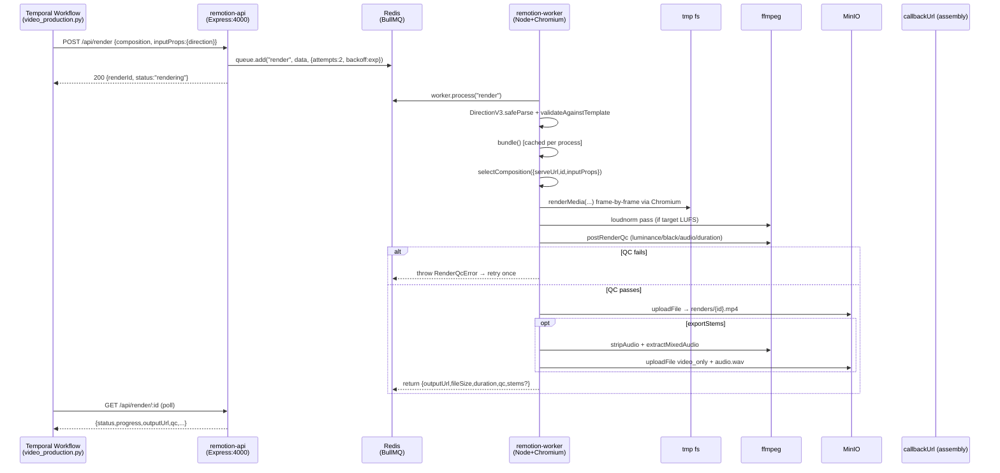

# 01 — Current State Audit

A technical audit of `services/remotion` as it exists today in this repo, with strengths, weaknesses, and a capability matrix against AE / Premiere / DaVinci / CapCut / Runway / Pika / Sora.

---

## 1.1 End-to-end trace (what happens today)



Concrete anchors:

- Enqueue: `@/home/saurabh/Desktop/YouTube/youtube-automation/services/remotion/src/api/server.ts:13-46`
- `RenderJobData` shape: `@/home/saurabh/Desktop/YouTube/youtube-automation/services/remotion/src/api/queue.ts:14-31`
- Bundle cache + render loop: `@/home/saurabh/Desktop/YouTube/youtube-automation/services/remotion/src/worker/renderer.ts:23-32`
- CRF mapping `quality` → `crf = max(1, round(51 - q/100*50))`: `@/home/saurabh/Desktop/YouTube/youtube-automation/services/remotion/src/worker/renderer.ts:132-148`
- Post-render QC: `@/home/saurabh/Desktop/YouTube/youtube-automation/services/remotion/src/worker/renderer.ts:162-179`
- Compositions + `calculateMetadata`: `@/home/saurabh/Desktop/YouTube/youtube-automation/services/remotion/src/Root.tsx:22-82`

## 1.2 Architectural layers today

```
┌───────────────────────────────────────────────────────────────────┐
│  CONTROL PLANE     remotion-api (Express) ─── BullMQ Queue         │
│                    └ POST /api/render, /api/thumbnail             │
│                    └ GET  /api/render/:id, /api/health            │
├───────────────────────────────────────────────────────────────────┤
│  DATA PLANE        remotion-worker                                │
│                    ├ @remotion/bundler  (webpack → serveUrl)      │
│                    ├ headless Chromium  (frame-by-frame)          │
│                    ├ @remotion/renderer (renderMedia/renderStill) │
│                    ├ ffmpeg  (loudnorm, stems, QC)                │
│                    └ MinIO upload                                 │
├───────────────────────────────────────────────────────────────────┤
│  REACT SCENES      Root.tsx → 3 compositions                      │
│                    MainVideo / ShortFormVideo / ThumbnailComp     │
│                    └ SegmentRenderer per direction.segments[]     │
│                    └ 23 scenes · 22 effects · 12 animations       │
│                    └ 13 overlays · 2 transitions · 3 branding     │
│                    └ 4 audio: Mixer/BGM/SFXTrigger/Voiceover      │
├───────────────────────────────────────────────────────────────────┤
│  ASSET LAYER       assetResolver.ts (250 LOC)                     │
│                    registry/{animations,transitions,effects,      │
│                              overlays,scenes,sfx,lut,grain}       │
├───────────────────────────────────────────────────────────────────┤
│  CONTRACTS         schemas/directionV3.ts (zod)                   │
│                    utils/compositionValidator.ts (template rules) │
│                    utils/postRenderQc.ts (gate)                   │
└───────────────────────────────────────────────────────────────────┘
```

## 1.3 Rendering pipeline (per-frame)

For each of `durationInFrames` frames:

1. Chromium navigates to `serveUrl#/MainVideo?frame=N`
2. React re-renders the `<Composition>` subtree at that frame
3. Page is rasterized to PNG (current `imageFormat: "png"`)
4. PNG is piped to ffmpeg, encoded with H.264 CRF derived from `quality`
5. After all frames: muxed with audio, optionally loudnorm, optionally split into stems, QC-gated, uploaded

Implications:

- **CPU-bound**. One Chromium per worker; `RENDER_CONCURRENCY` controls concurrent tab pages inside that Chromium, not GPU parallelism.
- **PNG intermediate** is lossless but heavy I/O. No direct GPU→encoder path.
- **React hydrates every frame** — animation state is purely a function of `frame`; there is no cross-frame optimization.
- **No frame-range sharding**: one render = one worker, start-to-end sequentially.
- **Bundle cache** is per-process only; a worker restart throws it away.

## 1.4 Composition / timeline system

- Timeline is **sequence-based**, not **track-based**: children of `<Sequence from={...} durationInFrames={...}>` stacked in React tree order.
- `calculateMetadata` derives total frames from `Σ direction.segments[i].duration_ms` — see `@/home/saurabh/Desktop/YouTube/youtube-automation/services/remotion/src/Root.tsx:34-46`.
- No NLE primitives: no ripple edit, slip, slide, roll, magnetic timeline, track enable/disable, nested sequences-as-clips.
- No **timeline mutation API** — you can't "ask" the timeline to insert a B-roll between segment 3 and 4 without regenerating direction-v3 upstream.

## 1.5 Asset pipeline

- `assetResolver.ts` (250 LOC) handles resolution.
- Gaps:
  - No content-addressed cache (sha256 of URL + transform params)
  - No CDN warm-up / signed-url prefetch
  - No deterministic hashing for reuse across renders of the same channel
  - No parallel prefetch driven by a scene-graph traversal (fetch happens *inside* React render → blocks frames)
  - No license / rights metadata propagation

## 1.6 Audio pipeline

- `AudioMixer.tsx`, `BackgroundMusic.tsx`, `SFXTrigger.tsx`, `VoiceoverTrack.tsx` compose in React.
- Loudness normalization is a **post-pass ffmpeg `loudnorm`** (two-pass correct? — check; currently single-pass, see `utils/loudnessNormalizer.ts`).
- Missing:
  - Sidechain ducking (music vs. VO) as a first-class primitive
  - Beat detection for cut snapping
  - Per-segment dynamic range control
  - Stem-wise EQ curves
  - Audio QC (peak/LRA/true-peak limits) beyond "hasAudio" boolean in `postRenderQc`

## 1.7 Cloud / scaling

- One BullMQ queue `render-queue`, `attempts: 2`, exponential backoff 5s.
- No Lambda, no serverless burst. Worker is a long-running docker container (4 GB memory limit per memory note).
- No render sharding, no frame-range child jobs, no progressive upload.
- Autoscaling is absent; single worker. Queue depth is visible in `GET /api/health` but not wired to a scaler.

## 1.8 Bundle / build

- Single `bundle()` call per worker process (`cachedBundle`).
- Webpack under the hood (Remotion default). No custom chunking, no lazy-load of heavy effects (e.g. `Premium3DText`, `LUTGradeWebGL`).
- TS strict, Zod schemas — strong contract boundary, which is a *big* asset.

## 1.9 QC system

- `postRenderQc` (`@/home/saurabh/Desktop/YouTube/youtube-automation/services/remotion/src/utils/postRenderQc.ts`) checks: duration within tolerance, mean luminance, black-frame fraction, hasAudio.
- Purely **reactive**: you spend the full render cost before knowing a scene is broken. No per-scene preview frames, no mid-render abort on luminance drift.
- No cross-render regression (did a prompt/registry change just make 30% of channels render darker?).

---

## 1.10 Strengths (why this foundation is worth evolving, not replacing)

| Strength | Why it matters | Anchor |
| -------- | -------------- | ------ |
| **Deterministic rendering** | Same direction → same bytes. Enables caching, replay, regression tests. | `@/home/saurabh/Desktop/YouTube/youtube-automation/services/remotion/src/Root.tsx:22-82` |
| **React composability** | Arbitrarily complex scenes as React trees; no proprietary DSL. | `components/scenes/*` |
| **Schema-validated input** | `DirectionV3` rejects malformed input before burning render budget. | `src/schemas/directionV3.ts` |
| **Template validator** | Second-layer check catches "valid JSON, invalid direction" cases. | `src/utils/compositionValidator.ts` |
| **Post-render QC gate** | Prevents broken outputs polluting MinIO + videos table. | `src/worker/renderer.ts:162-179` |
| **Registry plugin pattern** | New effects/scenes/animations drop in without touching the renderer. | `src/registry/*` |
| **Stems export** | Unlocks NLE round-trip (Premiere / DaVinci) — rare in OSS. | `src/worker/renderer.ts:187-207` |
| **Single bundle cache** | Avoids webpack cost per job (warm). | `src/worker/renderer.ts:23-32` |
| **Loudness normalization** | Loudness targeting (LUFS) baked into pipeline. | `src/utils/loudnessNormalizer.ts` |
| **Headless + containerized** | Runs identically in dev, CI, prod. | `services/remotion/Dockerfile` |
| **Schema-driven metadata** | `calculateMetadata` means duration/resolution follow content, not config. | `src/Root.tsx:34-70` |
| **TypeScript + Zod strict** | Agent mutations to the direction JSON fail fast. | whole `services/remotion/src/` |

## 1.11 Weaknesses (the real gap list)

Grouped by dimension. Each row includes severity and the extension surface.

### Rendering

| # | Weakness | Severity | Extension point |
| - | -------- | -------- | --------------- |
| R1 | Chromium per frame; no GPU compositor; no WebGPU offscreen pipeline | Critical | new `tier0-compositor/` + per-scene capability flag |
| R2 | PNG intermediate; no GPU→NVENC direct path | High | render worker encoder options |
| R3 | No frame-range sharding; one render = one worker | Critical | BullMQ `FlowProducer` wrapper around `renderQueue` |
| R4 | Bundle cache is per-process only | Medium | shared RO bundle volume + content-hash serveUrl |
| R5 | No incremental / diff rendering on prop change | High | scene-graph hash → frame cache in MinIO |
| R6 | No progressive upload (only post-complete) | Medium | streaming ffmpeg to MinIO multipart |
| R7 | CRF linear map ignores content complexity | Medium | rate-control model from `render_predictor` |
| R8 | No hardware-accelerated encoder selection (NVENC / QSV / VAAPI) | High | codec flag routing in `renderer.ts` |
| R9 | No render sandbox for OOM / infinite loop scenes | Medium | worker-level timeout + memory cap per scene |

### Timeline & composition

| # | Weakness | Severity | Extension point |
| - | -------- | -------- | --------------- |
| T1 | Sequence-ordered only; no tracks / lanes / groups | High | new `SceneGraph` IR lowered from direction-v3 |
| T2 | No agent-facing timeline mutation API | Critical | `/api/timeline/mutate` over scene graph |
| T3 | No nested sequences-as-clips | Medium | scene graph `compose` node |
| T4 | No keyframe authoring layer (only hardcoded animations) | High | `Keyframe[]` node kind + interpolator library |
| T5 | No time remapping / speed ramps as primitives | Medium | scene graph `speed` node → Remotion `playbackRate` |
| T6 | No multi-cam perspective switching | Low | multi-`Sequence` alias with picker node |

### Animation & motion

| # | Weakness | Severity |
| - | -------- | -------- |
| A1 | Motion is per-component ad-hoc React code | High |
| A2 | No shared motion-design language (no motion-one / framer primitives as a base layer) | Medium |
| A3 | No motion interpolation between scenes (optical-flow morph) | High |
| A4 | No physics primitives (spring networks, cloth, flocking) | Low |
| A5 | No motion-matching / auto-parallax from depth estimation | High |

### Asset management

| # | Weakness | Severity |
| - | -------- | -------- |
| M1 | No deterministic hash cache | High |
| M2 | No predictive prefetch | High |
| M3 | No license/rights metadata propagation | Medium |
| M4 | Stock-footage selection happens upstream; no visual re-rank inside compositor | High |
| M5 | No per-asset perceptual hashing (detect duplicate B-roll across videos) | Medium |

### Audio

| # | Weakness | Severity |
| - | -------- | -------- |
| AU1 | No sidechain ducking primitive | High |
| AU2 | No beat-snap | High |
| AU3 | No audio QC beyond `hasAudio` boolean | High |
| AU4 | No multitrack stem mixing (only single mixer component) | Medium |
| AU5 | No VO room-tone / de-noise / de-reverb pass | Medium |

### Intelligence (the giant gap)

| # | Weakness | Severity |
| - | -------- | -------- |
| I1 | QC is purely reactive (post-render) | Critical |
| I2 | No predictive QC (render-fail GBM exists in `assembly/render_predictor.py` but not consumed here) | Critical |
| I3 | No vision-LLM critic agent | Critical |
| I4 | No repair agent — bad render = full re-render | High |
| I5 | No scene-level retention prediction | High |
| I6 | No style/pattern learning loop into the compositor (voice-style learner exists, not rendering-style learner) | High |
| I7 | No auto-reframe subsystem | Critical |
| I8 | No content-aware editing (cut on silence, cut on beat, cut on face-turn) | High |
| I9 | No AI-generated B-roll planner tight-coupled to scene graph | High |
| I10 | No hallucination/copyright pre-render guardrails | High |
| I11 | No visual continuity engine (color palette / typography drift across segments) | Medium |
| I12 | No pacing engine tied to emotion arc | High |
| I13 | No brand-consistency check in renderer (only outside, post-delivery) | Medium |

### Cloud / scale

| # | Weakness | Severity |
| - | -------- | -------- |
| C1 | Single worker, no horizontal shard | Critical |
| C2 | No Lambda burst path | High |
| C3 | No autoscaling on queue depth | High |
| C4 | No regional render mesh | Medium |
| C5 | No cost-aware routing (WebGPU node vs. spot CPU vs. Lambda) | High |
| C6 | No frame deduplication across jobs | Medium |

### Developer / operator experience

| # | Weakness | Severity |
| - | -------- | -------- |
| D1 | No real-time preview server for agents / UI | Critical |
| D2 | No scene-graph visualizer | High |
| D3 | No render replay from logs | Medium |
| D4 | No per-scene timing flamegraph | High |
| D5 | No A/B render harness (same direction, 2 rendering configs) | High |
| D6 | No "golden master" perceptual regression tests | High |
| D7 | No interactive editor (no Remotion Studio proxy inside dashboard) | Medium |
| D8 | No prompt→preview loop for creators | High |

### Collaboration & editing workflow

| # | Weakness | Severity |
| - | -------- | -------- |
| E1 | No multi-user concurrent editing | Low (current stack is single-operator) |
| E2 | No version history on direction-v3 | Medium |
| E3 | No review workflow with timecoded comments | Medium |
| E4 | No approval gating inside the render loop | Medium |

### Multi-format

| # | Weakness | Severity |
| - | -------- | -------- |
| F1 | 16:9 and 9:16 are separate compositions, not a shared master | High |
| F2 | No 1:1 / 4:5 Instagram formats | High |
| F3 | No saliency-driven crop | Critical |
| F4 | No per-platform safe-zone enforcement | Medium |
| F5 | No adaptive bitrate ladder generation | Medium |

---

## 1.12 Competitive capability matrix

Legend: ✅ full, ◐ partial, ✗ missing.

| Capability | Remotion today | AE | Premiere | DaVinci | CapCut | Runway | Pika | Sora-class | Target future |
| ---------- | -------------- | -- | -------- | ------- | ------ | ------ | ---- | ---------- | ------------- |
| Programmatic API | ✅ | ◐ (ExtendScript) | ◐ | ◐ | ✗ | ✅ | ✅ | ✅ | ✅ |
| Deterministic render | ✅ | ✅ | ✅ | ✅ | ✅ | ✗ | ✗ | ✗ | ✅ |
| GPU compositor | ✗ | ✅ | ✅ | ✅ | ✅ | ✅ | ✅ | ✅ | ✅ (tier 0) |
| Hardware encoder (NVENC) | ✗ | ✅ | ✅ | ✅ | ✅ | n/a | n/a | n/a | ✅ |
| Distributed render | ✗ (Lambda OSS exists) | ◐ (teradici) | ✗ | ✅ | ✗ | ✅ | ✅ | ✅ | ✅ |
| Non-linear editor UI | ✗ | ✅ | ✅ | ✅ | ✅ | ◐ | ✗ | ✗ | ✅ (agentic) |
| Timeline mutation API | ✗ | ◐ | ✗ | ✗ | ✗ | ◐ | ◐ | ◐ | ✅ |
| Keyframing | ◐ (code) | ✅ | ✅ | ✅ | ✅ | ◐ | ✗ | ✗ | ✅ |
| Motion graphics library | ✅ (22 fx) | ✅ (thousands) | ◐ | ✅ | ✅ | ✗ | ✗ | ✗ | ✅+ |
| Color grading / LUTs | ◐ (LUT fx) | ◐ | ✅ | ✅✅ | ✅ | ✗ | ✗ | ✗ | ✅ |
| Multi-track audio | ◐ | ✅ | ✅ | ✅✅ | ✅ | ◐ | ✗ | ✗ | ✅ |
| Beat detection / snap | ✗ | ✗ | ◐ | ◐ | ✅ | ✗ | ✗ | ✗ | ✅ |
| Auto-captions | ◐ (word-aligned exists) | ✗ | ✅ | ✅ | ✅ | ✅ | ✗ | ✗ | ✅ |
| Auto-reframe | ✗ | ◐ | ✅ (Auto Reframe) | ✗ | ✅ | ✗ | ✗ | ✗ | ✅ |
| AI B-roll | ✗ | ✗ | ◐ | ✗ | ◐ | ✅ | ✅ | ✅ | ✅ |
| AI generation (txt2vid) | ✗ | ✗ | ✗ | ✗ | ◐ | ✅ | ✅ | ✅ | ✅ (via adapter) |
| Agent-driven editing | ✗ | ✗ | ✗ | ✗ | ✗ | ◐ | ✗ | ✗ | ✅ |
| Critic / repair agent | ✗ | ✗ | ✗ | ✗ | ✗ | ✗ | ✗ | ✗ | ✅ (novel) |
| Diff re-render cache | ✗ | ◐ | ◐ | ✅ | ✗ | ✗ | ✗ | ✗ | ✅ |
| Real-time preview | ◐ (Studio, dev only) | ✅ | ✅ | ✅ | ✅ | ◐ | ◐ | ✗ | ✅ |
| Collab (multi-user) | ✗ | ◐ | ◐ | ✅ (Collab) | ◐ | ◐ | ✗ | ✗ | ✅ |
| OSS | ✅ | ✗ | ✗ | ✗ | ✗ | ✗ | ✗ | ✗ | ✅ (core) |

Reading the matrix: Remotion today is *best-in-class* on programmability, determinism, and OSS. It trails every NLE and every AI-video startup on GPU compositing, reframing, agentic editing, diff cache, and real-time preview. The strategic move (sections 2–8) is to close those gaps **without giving up** the columns it wins.

---

## 1.13 Summary

- Core loop is solid: schema → bundle → Chromium → ffmpeg → QC → MinIO.
- Registry pattern, Zod schemas, and post-render QC are the three things worth preserving at all costs.
- The rendering tier, the asset cache, the timeline model, and the intelligence layer all need a redesign.
- Section 2 proposes that redesign.
