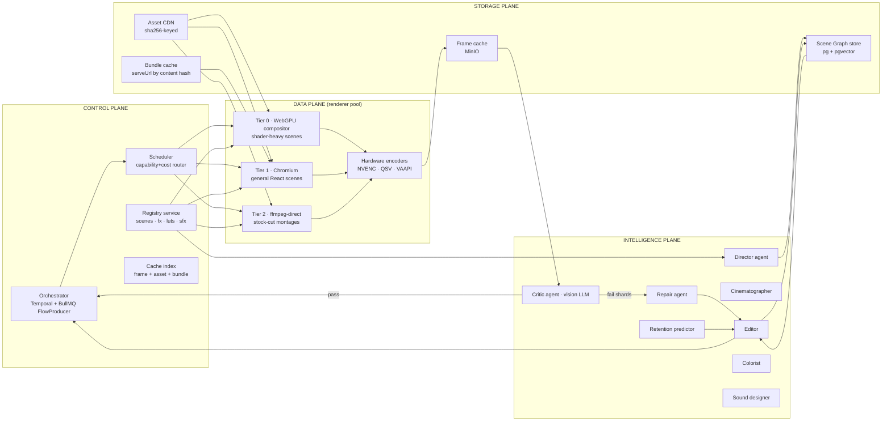
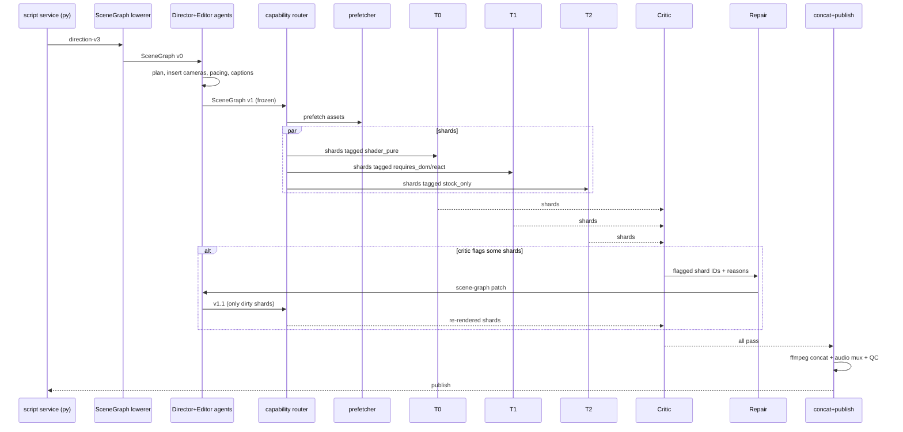

# 02 — Future Engine Architecture

How to transform the current `services/remotion` stack into an AI-native hybrid GPU/CPU cinematic compositor with a scene-graph IR, frame-range sharding, diff cache, and a multi-format reframer — **without** discarding the React-determinism that makes it valuable.

---

## 2.1 Target architecture (high level)



## 2.2 Subsystem inventory

| # | Subsystem | Status | Extends / replaces |
| - | --------- | ------ | ------------------- |
| S1 | **Direction-v3 → Scene Graph lowering** | NEW | sits between `src/services/script/direction_engine.py` (emitter) and `services/remotion/src/worker/renderer.ts` (renderer) |
| S2 | **Scene Graph IR + store** | NEW | new table `scene_graphs` in pg; `embedding` column in pgvector |
| S3 | **Capability router** | NEW | wraps existing `renderQueue` as `FlowProducer`, dispatches shards to tiered worker pools |
| S4 | **Tier 0 WebGPU compositor** | NEW | node binding (`wgpu-native` / `@webgpu/dawn`) off-screen surface → NVENC |
| S5 | **Tier 1 Chromium renderer** | KEEP | unchanged from `worker/renderer.ts` for scenes that require DOM/React arbitrary markup |
| S6 | **Tier 2 ffmpeg-direct** | NEW | filter-graph renderer for stock-only segments (no React needed) |
| S7 | **Frame-range sharder** | NEW | BullMQ `FlowProducer`, `{renderId, start, end}` children, ffmpeg concat parent |
| S8 | **Diff render cache** | NEW | sub-scene-graph hash → MinIO frame pack |
| S9 | **Asset CDN + predictive prefetch** | EXTEND `src/services/assetResolver.ts` | content-addressed; traversal-driven prefetch |
| S10 | **Hardware encoder routing** | EXTEND `worker/renderer.ts` | codec/flag autodetect NVENC/QSV/VAAPI/libx264 |
| S11 | **Real-time preview server** | NEW | WebRTC stream from a Tier-0 compositor instance for UI + agents |
| S12 | **Reframer** | NEW | scene graph → 9:16/1:1/4:5 via CLIP/SAM saliency |
| S13 | **MCP server** | NEW | tools: `propose_scene`, `render_preview`, `query_registry`, `get_qc_report` |
| S14 | **Agent topology** | NEW | Director/Cinematographer/Editor/Colorist/Sound/Critic/Repair — section 03 |
| S15 | **Predictive QC** | EXTEND `src/services/assembly/render_predictor.py` | runs *before* dispatch, reroutes risky scenes to safer primitive |

---

## 2.3 Scene Graph IR

The single most important new artifact. It is the typed, mutable, hashable representation of a video that all agents read/write and all renderers consume.

### 2.3.1 Node kinds (illustrative TS)

```ts
// illustrative — target: packages/scene-graph/src/types.ts
export type Ms = number;
export type Hash = string; // sha256 hex

export type SceneGraph = {
  id: string;
  version: 1;
  meta: { fps: number; width: number; height: number; durationMs: Ms };
  tracks: Track[];
  audio: AudioGraph;
  theme: ThemeRef;
  hash: Hash; // content hash over normalized tree
};

export type Track = {
  kind: "video" | "overlay" | "caption" | "fx";
  clips: Clip[];
};

export type Clip =
  | { kind: "scene"; type: string /* registry key */; props: Record<string, unknown>; range: [Ms, Ms]; hash: Hash }
  | { kind: "stock"; assetId: string; transform: Transform; range: [Ms, Ms]; hash: Hash }
  | { kind: "compose"; graph: SceneGraph; range: [Ms, Ms]; hash: Hash } // nested
  | { kind: "fx"; effect: string; params: Record<string, unknown>; target: ClipRef; range: [Ms, Ms]; hash: Hash }
  | { kind: "transition"; type: string; from: ClipRef; to: ClipRef; durationMs: Ms; hash: Hash }
  | { kind: "caption"; text: string; wordTimings: WordTiming[]; style: CaptionStyle; range: [Ms, Ms]; hash: Hash };

export type AudioGraph = {
  voiceover: AudioClip;
  music: AudioClip;
  sfx: AudioClip[];
  mix: MixNode[]; // {type:"duck", src:"music", by:"voiceover", ratio:0.35}
};
```

### 2.3.2 Why not just extend direction-v3?

- Direction-v3 is a **contract with upstream script service**. Mutating it means mutating an API consumed by multiple services.
- Scene Graph is an **internal IR** owned by the compositor. Agents mutate it without breaking upstream contracts.
- Lowering `directionV3 → SceneGraph` is a single pure function in `packages/scene-graph/lower.ts` that can evolve independently.

### 2.3.3 Hashing

- Every node carries a stable `hash` computed over a canonicalized JSON form (sort keys, strip nullable defaults, hash asset content not URL).
- Changing `clip.props.text` invalidates that clip's hash, propagates up to parent compose, up to graph root.
- Cache lookups key by node hash, not by `renderId`.

### 2.3.4 Agent ergonomics

```ts
// editor agent mutates scene graph
graph.tracks[0].clips.splice(2, 0, {
  kind: "scene",
  type: "StockFootageScene",
  props: { queries: ["city skyline dusk"], mood: "contemplative" },
  range: [12000, 15000],
  hash: "" // recomputed on commit
});
commit(graph); // recomputes hashes, revalidates, writes to pg + pgvector
```

## 2.4 Capability router (scheduler)

A render shard is dispatched to the cheapest tier that can render it.

```
capability flags computed per clip during lowering:
  requires_dom:      CodeTyping, BrowserMockup, SocialMockup
  requires_webgl:    LUTGradeWebGL, ShaderCanvas, Premium3DText
  requires_react:    most scenes (can relax per-scene)
  stock_only:        StockFootageScene with no overlays
  shader_pure:       effects where all inputs are shader-expressible

router decision per shard:
  if all(clip.stock_only) and no captions → Tier 2 (ffmpeg filter_complex)
  elif all(clip.shader_pure) → Tier 0 (WebGPU compositor)
  else → Tier 1 (Chromium)
```

Cost-aware extension (section 5): Tier 0 on L4 GPU ≈ 0.05×, Tier 1 on CPU ≈ 1×, Tier 2 ≈ 0.2×. Router considers queue depth and SLO.

## 2.5 Hybrid rendering tiers

### Tier 0 — WebGPU compositor

- Headless node process using `@webgpu/dawn` (or `wgpu-native` via rust addon).
- Maintains a library of **scene shaders** mirroring the React effect components: `KineticTypography`, `ParticleSystem`, `LUTGrade`, `Bloom`, `ChromaticAberration`, `FilmGrain`, `Glow`, `Vignette`, `MotionBlur`.
- Offscreen framebuffer → NVENC via zero-copy CUDA interop where available; fallback to `ffmpeg -f rawvideo` pipe.
- Expected speedup for effect-heavy scenes: **5–50×** vs Chromium per-frame.

### Tier 1 — Chromium (current)

- Unchanged. All scenes remain renderable here — Tier 0/2 is an *opt-in* optimization per scene.
- Extension: add a **per-frame timing sidecar** that emits `{frame, render_ms, scene_ms}` for flamegraphs.

### Tier 2 — ffmpeg-direct

- For `StockFootageScene` sequences with simple overlays (crossfades, Ken Burns), transcode directly via `filter_complex`:
  ```
  [0:v]scale=1920:1080,zoompan=...[v0];
  [1:v]scale=1920:1080[v1];
  [v0][v1]xfade=transition=fade:duration=0.5:offset=4.5[vout]
  ```
- Skips React entirely. 20–100× faster. Useful for long documentary / finance content that is 70% stock.

### Unified output contract

All three tiers emit **frame packs** (MP4 shards with same codec/GOP alignment) that the parent job's `ffmpeg concat` splices together. Shards are independently encodable because the sharder aligns boundaries to GOP / segment boundaries.

## 2.6 Frame-range sharding

```mermaid
sequenceDiagram
  participant API
  participant FP as FlowProducer
  participant S1 as shard 0..180
  participant S2 as shard 180..360
  participant S3 as shard 360..540
  participant PAR as concat parent

  API->>FP: add(parent, {children:[s1,s2,s3]})
  par shards run in parallel
    FP->>S1: render 0..180
    FP->>S2: render 180..360
    FP->>S3: render 360..540
  end
  S1-->>PAR: shard0.mp4
  S2-->>PAR: shard1.mp4
  S3-->>PAR: shard2.mp4
  PAR->>PAR: ffmpeg concat + audio mux
  PAR-->>API: final output
```

Boundary rules:

- Shard boundaries must fall on **segment boundaries** (no shard straddles a scene cut).
- Shard boundaries must align to **GOP** (keyframes only at cuts; use `-force_key_frames`).
- Audio is rendered once at the parent (from `AudioGraph`), not per-shard → no seam artifacts.

## 2.7 Diff render cache

```
key = hash(sub-scene-graph) + hash(tier+version+codec+resolution+fps)
value = MinIO object: frames/{key}.mp4  (the rendered shard)

lookup before dispatch:
  for each shard: if cache.has(key) → skip render, pull shard bytes directly
  else render → on success, cache.put(key, bytes)
```

Practical consequences:

- Editing the word in a caption at t=42s re-renders **only** the clip containing that word (~1 shard, often <5% of total frames).
- Re-rendering same video at 9:16 after 16:9 master: all *audio* cache hits; only geometry-dependent clips miss.
- Shared across channels: a LUT-graded stock montage used by two channels only renders once.

## 2.8 Asset CDN and predictive prefetch

Upgrade `@/home/saurabh/Desktop/YouTube/youtube-automation/services/remotion/src/services/assetResolver.ts`:

1. Replace URL passthrough with **content-addressed store**: first fetch → sha256 → put at `assets/{sha256}/{filename}` in MinIO; return signed URL with long TTL.
2. Add **scene-graph traversal prefetch**: orchestrator walks the graph *before* render dispatch and enqueues asset warm-ups in parallel.
3. Add **perceptual hashing** (pHash for images, tmk+pdqf for video) → dedupe + detect unintended cross-video reuse.
4. Add **rights metadata**: `license`, `attribution_required`, `usable_in_monetized`, `max_duration_s`. Direction-v3 already has stock fields — propagate to scene graph.

## 2.9 Hardware encoder routing

In `renderer.ts` replace hard-coded `codec: "h264"` with:

```ts
const encoder = selectEncoder({
  preferred: job.codec,
  available: detectEncoders(), // probes ffmpeg -encoders
  hasGpu: env.HAS_NVENC,
  resolution: composition.resolution,
});
// encoder ∈ {h264_nvenc, hevc_nvenc, h264_qsv, h264_vaapi, libx264}
```

NVENC saves roughly 10× encode wall time on 1080p60, slightly lower quality at equal bitrate → bump CRF equivalent by ~2.

## 2.10 Real-time preview

New service `remotion-preview` (Tier 0 compositor instance pinned to UI session).

```
Dashboard UI ──(WebSocket scene-graph patch)──▶ preview server
                                               │
                                               ├─ apply patch to resident graph
                                               ├─ re-compute dirty frame range
                                               ├─ render dirty frames → WebRTC video track
                                               │
Dashboard UI ◀────────────(WebRTC stream)───────┘
```

Latency target: < 300 ms from patch → visual change at current frame. Enables agent-in-the-loop editing and creator-facing prompt → preview.

## 2.11 Reframer (multi-format)

```
SceneGraph (master, 1920×1080)
        │
        ▼
┌─────────────────┐
│  Saliency pass  │  CLIP + SAM2 per keyframe → ROI boxes
└─────────────────┘
        │
        ▼
┌─────────────────────────────────────────────────────┐
│  Reframer                                           │
│  for each clip:                                     │
│    smooth ROI trajectory (Kalman)                   │
│    map to 9:16 / 1:1 / 4:5 target viewport          │
│    generate pan/zoom keyframes                      │
│  for each caption:                                  │
│    re-flow to safe-zone of target platform          │
│  for each overlay:                                  │
│    snap to platform-specific anchor                 │
└─────────────────────────────────────────────────────┘
        │
        ▼
 SceneGraph' (9:16)   SceneGraph' (1:1)   SceneGraph' (4:5)
```

All derived graphs share the same audio, same assets, same theme. Only geometry/caption clips are regenerated → diff cache hits for everything else.

## 2.12 Cinematography as scene-graph nodes

Introduce **virtual camera** nodes:

```ts
type CameraNode = {
  kind: "camera";
  range: [Ms, Ms];
  motion: "push" | "pull" | "orbit" | "parallax" | "whip" | "static";
  intensity: number;        // 0..1
  easing: EasingCurve;
  anchor?: { x: number; y: number }; // for orbit
};
```

Cinematographer agent (section 03) inserts these based on emotion/duration tables. Tier 1 lowers them to existing `CameraShake` / zoom wrappers; Tier 0 lowers them to affine transforms in-shader.

## 2.13 Procedural storytelling (beat sheet → graph)

Separate concerns:

- `src/services/script/` (Python) owns the **narrative** → emits direction-v3.
- `packages/scene-graph/story.ts` (TS) owns **visual beats** → maps narrative acts to scene-graph patterns.

Patterns library: `hook_cold_open`, `list_3_2_1`, `before_after`, `data_reveal`, `myth_vs_truth`, `problem_agitate_solution`, `documentary_arc`. Each pattern emits a sub-SceneGraph that the editor agent can slot in.

## 2.14 End-to-end future sequence



---

## 2.15 Invariants & contracts

These must hold through the redesign:

1. **Determinism**: `(SceneGraph, tier_version) → bytes` is a pure function.
2. **Zod schema validation** remains the outer gate — direction-v3 unchanged for upstream.
3. **PostRenderQc is a floor, not a ceiling** — critic agent adds higher-level gates; QC stays.
4. **Registry pattern preserved**: every new effect/scene/transition is registered once, usable by all three tiers (with tier-specific adapters).
5. **All three tiers emit bitstream-compatible shards** so concat is lossless.
6. **Scene graph is the only thing agents mutate**. No agent writes raw ffmpeg, no agent emits direction-v3 back to script service.

## 2.16 Risk register

| Risk | Likelihood | Mitigation |
| ---- | ---------- | ---------- |
| WebGPU shader library takes longer to build than expected | High | Start with 5 highest-traffic effects; keep Tier 1 fallback always-on. |
| Shard boundaries break audio sync | Medium | Render audio centrally at parent, never per-shard. |
| Diff cache key drift (false hits) | Medium | Include tier+version+ffmpeg-version in cache key. |
| Reframer produces bad crops | High | Human-in-loop preview for new channels; per-niche calibration. |
| Scene graph spec churn | High | Version field + migration layer (`lower_v1_to_v2`). |
| Critic agent hallucinates pass on broken render | Medium | Keep `postRenderQc` numeric gate. Require critic + QC both pass. |

Next: section 03 — the intelligence layer.
