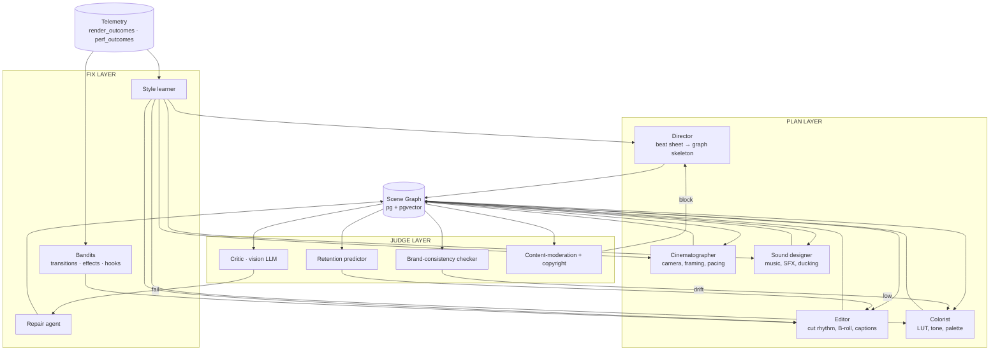

# 03 — Intelligence Layer

The set of agents, models, and feedback loops that sit on top of the Scene Graph IR and turn Remotion from a deterministic renderer into an autonomous cinematic production system.

---

## 3.1 Agent topology



Each agent is a **stateless function over SceneGraph + context** (channel brand DNA, niche priors, historical performance). The state lives in pg + pgvector.

## 3.2 Agent contracts

Illustrative TS interface (target `packages/agents/src/types.ts`):

```ts
export interface Agent<I, O> {
  name: string;
  version: string;
  run(input: I, ctx: AgentCtx): Promise<O>;
  critique?(output: O, ctx: AgentCtx): Promise<CritiqueReport>;
}

export type AgentCtx = {
  channelId: string;
  niche: string;
  brandDna: BrandDNA;          // extends src/services/brand/brand_dna.py export
  history: ChannelStats;       // CTR, retention curves, top patterns
  budget: Budget;              // tokens + render-min allowances
  policy: ContentPolicy;       // monetization-safe, language, etc.
};
```

Specific agents:

| Agent | Input | Output | Primary source of truth |
| ----- | ----- | ------ | ----------------------- |
| Director | `directionV3 + brandDna + patterns` | `SceneGraph v0` (skeleton) | `src/services/script/direction_engine.py` already provides shape |
| Cinematographer | `SceneGraph v0` | `SceneGraph v0 + camera/pace nodes` | emotion arc + `prosody_engine` |
| Editor | `SceneGraph v0+cameras` | `SceneGraph v1` (B-roll, transitions, captions) | `asset_engine`, `assetResolver`, retention model |
| Colorist | `SceneGraph v1` | `v1 + LUT/tone nodes` | `registry/lutLibrary.ts`, brand palette |
| Sound designer | `v1 + voiceover path` | `v1 + music/sfx/mix nodes` | `registry/sfxLibrary.ts`, beat detector |
| Critic | `rendered frame strip` | `{scenes:[{id,score,reasons}]}` | vision LLM (local or API) |
| Repair | `critic report + SceneGraph` | `SceneGraph patch` | rule table + LLM fallback |
| Retention predictor | `SceneGraph` | `{curve:[f→retention], low_points:[]}` | GBM over features |
| Brand checker | `rendered frames + brandDna` | `{drift_score, offenders}` | CLIP embedding distance |
| Moderator | `SceneGraph + renders` | `{pass|block, reasons[]}` | pHash + NSFW + copyright DBs |
| Style learner | `render_outcomes` | `updates to priors` | GBM + bandit update |

## 3.3 Self-learning loops

There are four closed loops, each wired to an existing or extension table in pg.

### 3.3.1 Render-quality loop

```
SceneGraph features ──▶ render_outcomes ──▶ QC pass/fail + critic score
                             │
                             ▼
                    GBM predictor (render_fail_risk)
                             │
                             ▼
  at dispatch time: if risk > 0.6 → simplify (drop risky effect) before render
```

Extends `@/home/saurabh/Desktop/YouTube/youtube-automation/src/services/assembly/render_predictor.py`. New features from scene graph: node count, max effect depth, shader tier, asset sizes, duration.

### 3.3.2 Retention loop

```
Analytics (YouTube) retention curves ──▶ video_outcomes
SceneGraph features per 3-sec window ──▶ retention_features
                             │
                             ▼
    Sequence model (small transformer or GBM) → predicted curve
                             │
                             ▼
         Editor queries before commit: "will segment k dip?"
           → Editor adjusts cut frequency / inserts pattern interrupt
```

Extends `@/home/saurabh/Desktop/YouTube/youtube-automation/src/services/analytics/pattern_miner.py`. Training data already collected per memory `08bf3aef`.

### 3.3.3 Style loop

```
Per-channel outcomes ──▶ channel_style_priors
       │
       ▼
 Director/Editor sample from priors (emotion weighting, cut rhythm,
 effect palette, typography) with bandits over arms.
```

Arms per cluster: `hook_style ∈ {question, shock, stat, story, paradox}`, `pacing ∈ {fast, medium, slow, dynamic}`, `transition_family ∈ {cuts_only, zoom_punch, whip, flash, mixed}`, `caption_style ∈ {word_karaoke, line_fade, full_screen, side_bar}`. Thompson sampling, reward = 24h retention × CTR.

### 3.3.4 Repair loop

```
Critic flags shard → repair rules table
  if reason == "text overflow"  → shrink_font + re-lay caption
  if reason == "black flash"    → insert 3-frame crossfade from prior clip
  if reason == "color drift"    → reapply Colorist
  if reason == "asset mismatch" → Editor re-queries assetResolver with stricter filter
  else → LLM fallback with scene-graph patch tool
```

Only the flagged shards are re-rendered (diff cache ensures everything else is cheap).

## 3.4 Vision critic agent

- **Input**: every K frames (default K=30 @ 30fps → 1 sample/sec) plus a thumbnail of the full video.
- **Model**: can run on a local VLM (e.g. Qwen2-VL, InternVL) for cost; API (GPT-4o / Claude Sonnet vision) for quality.
- **Rubric** (JSON-strict output):

```json
{
  "composition": {"score": 0..10, "issues": []},
  "motion_smoothness": {...},
  "text_legibility": {...},
  "cut_rhythm": {...},
  "color_consistency": {...},
  "brand_fit": {...},
  "audio_balance_perception": {...},
  "overall": 0..10,
  "shards_flagged": [{"shardId":"s3","reason":"text_overflow","severity":"high"}]
}
```

- **Calibration**: ground-truth against a seed of 500 human-rated renders per niche; isotonic-calibrate scores.
- **Failure mode**: critic says pass, numeric `postRenderQc` still runs — both must pass.

## 3.5 Retention predictor

Features per 3-second window:

- Scene type, scene age in video (seconds from start), cuts in window, avg shot length in window
- Motion energy (sum of camera node intensities + transition density)
- Text density (caption chars / second), text-change events
- Audio energy (dBFS RMS), voiceover density
- Emotion tag (from prosody)
- Pattern-interrupt flag (hook restart, zoom punch, reveal)

Label: YouTube retention % at that window from `video_outcomes`.

Model: XGBoost per niche to start; upgrade to small transformer per-channel once >10k labeled windows available.

## 3.6 Brand consistency engine

- Encode brand reference frames (intro, outro, channel thumbnails) via CLIP.
- For each rendered video: sample 30 frames, compute CLIP embeddings, compare centroid distance to brand reference cluster.
- Flag if distance > per-channel threshold (auto-tuned).
- Feeds back into Colorist + Cinematographer agents (LUT adjustment, typography correction).
- Extends `@/home/saurabh/Desktop/YouTube/youtube-automation/src/services/brand/brand_dna.py`.

## 3.7 Copyright + moderation guardrails

Pre-render:

- Music: match `audio.music` track against a local perceptual hash DB of known-copyright tracks. Block if match > 0.9.
- Stock footage: verify license metadata; block if `license == "editorial_only"` for monetized channel.
- Script: OpenAI/Perspective moderation API pass on voiceover text.

Post-render:

- pHash final video against previously published renders (detect accidental duplicates across channels).
- SynthID / invisible watermark for AI-generated B-roll traceability.

## 3.8 Memory system

Three tiers, all in pg:

1. **Short-term (render context)**: agent scratchpads per job, TTL 24h. Key `(jobId, agentName)`.
2. **Medium-term (channel)**: per-channel style priors, last 100 renders' critic scores, last 30 days' performance outcomes. Feeds all agents.
3. **Long-term (niche + global)**: patterns that generalize — e.g. "finance/hook_style=stat lifts retention 12%". pgvector stores embeddings for similarity queries.

New tables (additive to existing schema):

- `scene_graphs(id, version, graph jsonb, embedding vector(768), created_at)`
- `agent_runs(id, job_id, agent, input_hash, output_hash, latency_ms, cost_usd, success)`
- `critic_reports(id, job_id, frame_index, rubric jsonb, overall_score, flagged jsonb)`
- `retention_features(job_id, window_start_s, features jsonb, label_retention float)`
- `channel_style_priors(channel_id, cluster, arm, alpha float, beta float, updated_at)` (bandit state)
- `repair_rules(id, reason, action jsonb, success_rate float)`

## 3.9 Training data

| Signal | Source | Volume needed |
| ------ | ------ | ------------- |
| QC pass/fail | existing `postRenderQc` + `render_outcomes` | 1k / niche for GBM |
| Critic score | new critic + human sample | 500 human-rated + bootstrap |
| Retention | YouTube Analytics API + `video_outcomes` | 3k videos for per-niche model |
| Brand drift | self-supervised (distance to brand centroid) | unlimited |
| Arm performance | online bandits | streamed |

Cold start: synthesize from `scripts/generate_training_data.py` (per memory `08bf3aef`) + 2 weeks of production telemetry.

## 3.10 RLHF

Phase 1 (cheap): pairwise preference over *variants* of same direction.

- For 5% of jobs, render 2 scene-graph variants (one with arm A, one with arm B).
- Human reviewer picks preferred in existing human-review UI.
- Train preference model; incorporate as reward alongside retention.

Phase 2: DPO on a preference-tuned small editor LLM. Input = SceneGraph + history, Output = patch op list.

## 3.11 Agentic workflow architecture

```
Temporal workflow: VideoProductionWorkflow  (existing)
  Phase 1 Research
  Phase 2 Script
  Phase 3 Direction                          (emits direction-v3)
  Phase 4 Assembly                           (existing render service)
  ────────────────────────────────────────
  NEW: Phase 4.5  SceneGraph compile + agents
       activities:
         - lower_to_scene_graph
         - director_plan
         - cinematographer_pass
         - editor_pass
         - colorist_pass
         - sound_pass
         - predictive_qc
         - dispatch_render         ← shards
         - critic_pass
         - repair_loop (bounded retries)
         - finalize_concat
  Phase 5 Delivery                           (existing)
```

All activities are idempotent and cache-aware: on retry, a pass that already produced a committed SceneGraph skip re-runs.

## 3.12 MCP integration

Remotion exposed as MCP server. Tools:

| Tool | Input | Output |
| ---- | ----- | ------ |
| `propose_scene` | `{sceneType, params, atMs, durationMs}` | SceneGraph patch (not committed) |
| `render_preview` | `{sceneGraphPatch, rangeMs}` | signed URL to MP4 preview |
| `query_registry` | `{kind?: "effect"|"scene"|"transition"|"lut"}` | registry entries + capability flags |
| `get_qc_report` | `{jobId}` | `postRenderQc` + critic report |
| `list_channels` | `{}` | channel ids + brand DNA summary |
| `get_retention_curve` | `{channelId, lastN}` | retention curves |
| `run_bandit_sample` | `{cluster}` | arm id + current alpha/beta |

This turns the whole compositor into an agent-accessible surface: external copilots can draft edits, request previews, and commit patches without going through the Python services.

## 3.13 User-preference learning

Per-channel preferences are **inferred, not asked**:

- Every manual edit in the dashboard (accept/reject a B-roll suggestion, swap a transition, adjust a LUT strength) is logged as a `preference_event`.
- Over 50+ events, a small per-channel preference vector is fit and used to re-weight bandit priors.

## 3.14 Federated learning (future)

Multi-tenant deployment:

- Each tenant trains local heads on their own `retention_features`, `critic_reports`.
- Aggregate via FedAvg on a shared backbone (the feature-encoder part of the retention model).
- Gradient compression + DP noise before aggregation.
- Tenants get private priors; the commons gets a better feature encoder.

## 3.15 Agent cost budgets

Without discipline, agents can blow budget on LLM calls.

- Each agent declares `tokens_per_call_max` + `calls_per_job_max`.
- Orchestrator enforces and degrades gracefully: if budget exceeded, fall back to rule-based default.
- Critic runs on local VLM first; API VLM only for borderline scores (5.0–7.0 range).

## 3.16 Observability

Extends existing `src/services/experiments/observability.py`:

- `decision_points`: every agent decision with {local, llm, fallback} path.
- `cost_breakdown`: per-phase cost per video.
- `agent_latency_p95`.
- `critic_pass_rate, repair_success_rate`.
- `arm_uplift`: last-30d lift of each bandit arm vs control.

Dashboards in Grafana already configured (`observability/grafana/dashboards/`). New panels added, not new stack.

## 3.17 Invariants

1. Every agent output is a **deterministic function of input + seed**. Randomness is seeded per job.
2. Every agent writes a **committable patch**, never a direct mutation — orchestrator commits atomically.
3. Critic can **never downgrade** the numeric QC floor; both must agree on pass.
4. Bandit updates happen **only after** published-video performance data arrives, not on critic score alone.
5. All agent runs are **cost-tagged** and cost-capped per job.

Next: section 04 — applying this to faceless YouTube video generation.
