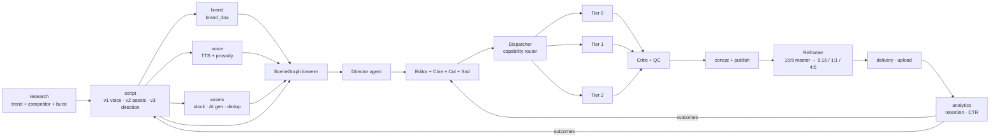

# 04 — Faceless Video Generation Engine

How the architecture of sections 2 and 3 applies to the specific product target of this repo: autonomous faceless YouTube/Shorts production at channel scale.

---

## 4.1 End-to-end pipeline (grounded in existing services)



Existing services that stay unchanged in function: `research`, `script`, `voice`, `assets`, `brand`, `delivery`, `analytics`. The new boxes are `SceneGraph lowerer`, the agent quintet, the dispatcher, critic, reframer.

## 4.2 Supported niches and archetypes

Each niche maps to a **story pattern** + **scene palette** + **audio palette**. Picked at Director time.

| Niche | Story pattern | Scene palette | Audio palette |
| ----- | ------------- | ------------- | ------------- |
| Documentary | doc_arc (intro → tension → resolution) | StockFootageScene, MapAnimation, TimelineAnimation, KineticTypography | cinematic score, low-frequency beds, subtle foley |
| Motivational | problem_agitate_solution | FullScreenText, StockFootageScene, QuoteCard, TextStrokeReveal | rising epic, percussive hits |
| Finance | data_reveal + list_3_2_1 | DataVisualization, ListAnimation, CountUp, PhoneMockup | corporate neutral, soft piano |
| Educational | concept_reveal | FlowchartAnimation, IconAnimation, SplitComparison, TextStrokeReveal | clean ambient, marimba accents |
| Explainer | problem_agitate_solution (shorter) | HookOpener, IconAnimation, AdvancedKineticText, ListAnimation | upbeat, clicky UI SFX |
| News-style | news_block | KineticTypography, MapAnimation, LowerThird, ChapterMarker | newsroom bed, subtle urgency |
| Motion graphic | pure_visual | KineticTypography, AdvancedKineticText, ParticleSystem, 3DLogoReveal | sync to beat, heavy SFX |
| Animated infographic | data_reveal | DataVisualization, FlowchartAnimation, IconAnimation | light electronic, SFX reveal stingers |
| 2D animated | story_driven | IconAnimation, FlowchartAnimation, custom Lottie | playful, piano + strings |
| AI storytelling | documentary_arc | StockFootageScene (AI gen B-roll), QuoteCard, TextStrokeReveal | cinematic |

All scenes in the right column already exist — see `@/home/saurabh/Desktop/YouTube/youtube-automation/services/remotion/src/components/scenes/`.

## 4.3 Director agent — script to SceneGraph skeleton

Input: `directionV3` + `brandDna` + niche profile.

Algorithm (pseudocode):

```python
def director_plan(direction, brand, niche):
    pattern = pick_pattern(niche, direction.hook_style, bandit_sample("pattern"))
    acts = pattern.split_acts(direction.segments)
    graph = SceneGraph(meta=meta_from(direction), theme=theme_from(brand))
    for act in acts:
        for seg in act.segments:
            archetype = map_segment_to_archetype(seg, niche, brand)
            graph.append(
                clip=make_scene_clip(archetype, seg, brand),
                caption=make_caption_clip(seg.word_timings, brand.caption_style),
            )
    graph.audio = make_audio_graph(direction.voiceover, pick_music(niche, brand), sfx_plan(acts))
    return graph
```

`map_segment_to_archetype` is a lookup table with bandit-adjusted weights per channel. Output: a SceneGraph skeleton that already renders end-to-end if nothing else runs — every downstream agent is a *refinement*.

## 4.4 Shot planning & asset discovery

Editor agent, per segment:

1. NER + keyword extraction from segment text (already done upstream in `script/asset_engine.py`).
2. Query `assets` service → candidate list with CLIP embeddings + license metadata.
3. Re-rank by:
   - CLIP similarity to segment text
   - CLIP similarity to brand reference frames (avoid style drift)
   - pHash novelty (penalize recently used across channel)
   - Duration fit (|asset_duration - required_duration| minimized)
   - License compatibility
4. Pick top-1; fall back to AI generation (Runway/Pika/SDXL-video) if top score < threshold.
5. Attach as `Clip{kind:"stock", ...}` in scene graph, carrying license + attribution metadata.

## 4.5 Subtitle orchestration

Word-aligned captions already exist: `@/home/saurabh/Desktop/YouTube/youtube-automation/services/remotion/src/components/overlays/WordAlignedCaption.tsx`.

Pipeline:

1. Voice service emits per-word timestamps (Edge TTS + forced alignment via `whisper-timestamped`).
2. SceneGraph lowerer attaches `{kind:"caption", wordTimings}` per segment.
3. Editor agent picks caption style per niche + brand + emotion: `word_karaoke`, `line_fade`, `full_screen`, `side_bar`.
4. Reframer re-lays captions into safe zone per platform (YouTube, Shorts, Reels, TikTok).
5. Critic checks legibility (contrast ratio vs background region) — flags if WCAG-like threshold fails.

## 4.6 Pacing engine

Emotion arc from `prosody_engine` → target cut frequency curve:

```
emotion_intensity:  ─────▁▂▃▅▆▅▃▂▁▁▂▄▆█▇▅▃
target_cps:          0.3 0.4 0.5 0.7 0.9 ... (cuts per second)
```

Editor inserts cuts (B-roll swaps, scene boundaries, motion pulses) to hit target curve subject to narrative integrity (don't cut mid-sentence). Retention predictor gates the plan — if a segment is predicted < X% retention, increase pacing intensity or insert pattern interrupt.

## 4.7 Auto B-roll

Default B-roll density: ~1 shot per 3–5 sec of voiceover for documentary; ~1 per 1.5–2 sec for motivational; ~1 per 6+ sec for financial/educational.

B-roll planner:

1. Detect segments without explicit B-roll in direction-v3.
2. For each, generate 2–3 candidate queries from NER + embeddings.
3. Query `assets` in parallel.
4. Apply 4.4 ranking.
5. Insert as overlay track with crossfade transitions.

## 4.8 Music synchronization

```
voiceover waveform ──▶ librosa ──▶ {beats_sec, tempo, downbeats}
                                       │
                                       ▼
                          Editor: snap major cuts to nearest downbeat
                                       │
                                       ▼
                          Sound: sidechain duck music by VO envelope
                                 (ducking ratio: 0.25–0.4 during VO)
```

Music selection per niche+brand uses a local library tagged with `mood`, `tempo_bpm`, `energy_curve`. Bandit arm over sub-libraries to learn what works per channel.

## 4.9 Emotion-aware color grading

Colorist agent:

- Each segment has an emotion tag (joy/tension/awe/contemplation/etc.) from prosody.
- LUT library (`src/registry/lutLibrary.ts`) tagged per emotion.
- Apply base LUT per brand, then per-segment tint adjustment (small, max ΔE < 10 from brand centroid).
- Brand checker validates drift.

## 4.10 Hook optimization

Critical for faceless content. First 3 seconds = 80% of retention determinant.

Approach:

- For each job, render **N hook variants** (cheap, only 3 sec each).
  - N=3 initial, scaled by channel volume.
- Variants differ in: opening scene type, first caption style, first music bar, voiceover take.
- Critic agent + retention predictor scores each variant.
- Ship the top variant as the main; the others logged for bandit training.
- Eventually: A/B test in production (YouTube supports multi-thumbnail + we can test hooks by publishing cohorts).

## 4.11 Retention engineering

Pattern interrupts inserted at predicted dip points:

- At predicted dip + 2 sec lookahead: insert a zoom-punch transition, a new caption style, a big SFX hit, or a scene-type change.
- Upper bound: 1 interrupt per 20 sec to avoid ADHD-ish feel.
- Efficacy measured after publish → bandit reward.

## 4.12 Multi-platform formatting

Single **master SceneGraph** at 1920×1080 → Reframer emits:

| Target | Resolution | Platform | Safe-zones |
| ------ | ---------- | -------- | ---------- |
| 16:9 long | 1920×1080 | YouTube | top 10% title, bottom 10% progress |
| 9:16 short | 1080×1920 | Shorts / Reels / TikTok | top 15% UI, bottom 20% caption+UI |
| 1:1 | 1080×1080 | Instagram feed | symmetric |
| 4:5 | 1080×1350 | Instagram feed preferred | bottom 10% |
| 16:9 preview | 1280×720 | Thumbnail cards | n/a |

Reframer steps detailed in section 02. Caption re-flow, overlay anchor remap, camera retargeting all happen on the derived graph.

## 4.13 Shorts/Reels/TikTok architecture

A Short is **not** a cropped long-form — it's a different narrative pattern:

- ≤ 60 sec
- Hook in frame 1
- One narrative beat
- Hard cut every ~1.5s
- Subtitles always on, center-safe
- Vertical native

Director agent has a `short_mode` flag that picks from a separate pattern library:

- `micro_reveal`: 0–3s setup → 3–15s tension → 15–30s payoff → 30–45s twist
- `1_tip`: hook → single actionable tip → cta
- `myth_bust`: myth stated → busted with evidence
- `before_after`: 2-state comparison

Uses `ShortFormVideo` composition (already exists) as output binding.

## 4.14 Multi-language generation

Already feasible:

- TTS provider abstraction supports multi-language (Edge TTS natively, Fish Audio per language).
- Captions regenerated per-language with forced alignment.
- Single SceneGraph master renders N language variants; only voiceover + caption clips change → enormous diff-cache hit.
- Topology: publish per-language channels or use YouTube's audio track feature.

## 4.15 Voice cloning + dubbing

- For creators who want a consistent voice across videos: TTS provider already plug-and-play (see memory `d4156b03`). Add voice-clone providers (ElevenLabs PVC, Fish Audio clone) behind the same ABC.
- Dubbing: for each non-source language, run speech-to-text on source voiceover, translate (preserving timing hints), re-synthesize with cloned voice, re-align captions.
- Lip-sync: N/A for faceless. Flagged as "future if vertical extends to AI avatars".

## 4.16 Auto branding

Brand consistency loop:

- `brand_dna` service exposes palette, typography, LUT, intro, outro, watermark preferences.
- Director/Colorist read from it.
- Reframer applies brand-specific safe zones.
- Critic's brand checker validates final output.
- When a channel's performance improves, we update the brand priors (small moving window) — brand identity co-evolves with what works, within creator-imposed hard constraints (e.g. "never use red tint").

## 4.17 Example — end-to-end documentary

Inputs: 8-minute documentary script on "The 1973 oil crisis", finance/history niche, existing channel with 50k subs and 11% retention baseline.

Flow:

1. Research → already has trend signal "retro finance explainers up 40%" and pattern "historical documentary" dominates niche.
2. Script v1/v2/v3 → directionV3 with 24 segments, emotion arc starting neutral, rising to tension, resolving contemplative.
3. Voice → Fish Audio, documentary-style, 20ms word timings.
4. Assets → 24 stock clips (archival 1970s footage + maps), 3 AI-generated supplementary (city montage, pump footage).
5. Lower → SceneGraph v0: 24 stock-backed scenes, 3 map animations, 2 data viz, voiceover + BGM stem.
6. Director → picks `doc_arc`, inserts cold-open HookOpener (first 6 sec), arc structure verified.
7. Cinematographer → slow pushes on archival footage, orbits on maps, static on data viz.
8. Editor → auto B-roll density 1/4.5s, cuts snapped to prosody accents, caption style `line_fade`.
9. Colorist → muted desaturated LUT for archival; brand LUT for modern segments.
10. Sound → low-frequency bed + subtle foley + reveal stingers at act breaks; VO ducking at -8 dB.
11. Predictive QC → no risky shards. Proceeds.
12. Dispatcher → splits into 6 shards; 3 stock_only → Tier 2, 2 react-heavy data-viz → Tier 1, 1 shader_pure kinetic cold-open → Tier 0.
13. Critic → pass, overall 8.6.
14. Concat + QC → pass.
15. Reframer → generates 9:16 3-minute cut (Shorts) from arc highlights.
16. Delivery → upload both, with SEO.
17. Analytics → 48h later, retention dip detected at 4:20 mark → goes into training data; next documentary for this channel, editor inserts pattern interrupt at that arc position.

Expected cost per 8-min documentary (tier-routed, with diff cache): **$0.08–0.18**. Without tier routing / cache: $0.35–0.80. Today (single-tier Chromium, no cache): $0.40–1.10.

## 4.18 Contract summary

The faceless engine's SLA with the rest of the stack:

- **Input**: valid `directionV3` JSON + `channelId`.
- **Output**: signed URLs to long + short(s) + thumbnail + caption files + QC/critic reports + per-scene cost breakdown.
- **Latency target**: p95 12 min for 10-min long-form on default infra; p95 45 s for 60-s short with warm cache.
- **Reliability target**: p99 QC-pass on first attempt after repair loop; 0% publish of critic-fail content.
- **Cost target**: < $0.20 per 10-min long-form fully AI; < $0.05 per Short with master already rendered.

Next: section 05 — how to actually hit the scale this implies.
