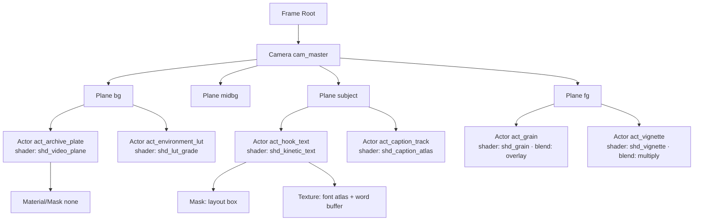
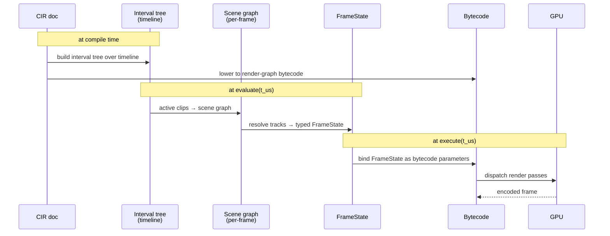

# 03 — Timeline grammar & Scene Graph

The two things the kernel walks at evaluation time:

- **Timeline tree** — a typed, recursively-nested DAG of timeline nodes that places clips on the t-axis.
- **Scene graph** — the spatial/material/dependency graph that says how each clip composites into a frame.

These are orthogonal. A timeline says *when*; a scene graph says *what* and *how*.

---

## 3.1 Timeline node taxonomy

```text
TimelineNode
├── timeline.sequence      ── ordered children, sums their durations
├── timeline.parallel      ── children all start at parent's t=0
├── timeline.track         ── lane within a sequence (z-stack semantics)
├── timeline.clip          ── a leaf placing one actor with bound tracks
├── timeline.group         ── named clip-set with shared time origin & params
├── timeline.compose       ── nested CIR sub-document inlined as a clip
├── timeline.branch        ── conditional on a boolean expression node
├── timeline.switch        ── multi-way branch on a typed selector
├── timeline.loop          ── replay child N times or until predicate
├── timeline.warp          ── time-remap (speed ramp, slip, freeze) child
├── timeline.reactive      ── mutates downstream children based on a signal
└── timeline.template      ── parameterized timeline that yields children
```

Every node has:

```jsonc
{
  "kind": "timeline.<variant>",
  "id": "tl_…",
  "duration_us": 123456,
  "tags": ["doc_arc.act1", "hook"],
  "scope": { "seed_offset": 0, "rng_namespace": "tl_id" },
  "hash": "sha256:…",
  ...variant-specific fields
}
```

`scope.seed_offset` is what makes deterministic randomness composable: any
node's seed = `seed_root XOR sha256(tl_id) XOR scope.seed_offset`.

## 3.2 sequence

```jsonc
{
  "kind": "timeline.sequence",
  "id": "tl_act1",
  "duration_us": 38000000,
  "children": [
    { "$ref": "tl_hook" },          // 0      .. 6000000
    { "$ref": "tl_premise" },       // 6e6    .. 18e6
    { "$ref": "tl_setup" }          // 18e6   .. 38e6
  ]
}
```

Children are placed end-to-end. `duration_us` is the sum (compile-time
checked). `$ref` resolves into the `timeline.nodes` registry.

## 3.3 parallel

```jsonc
{
  "kind": "timeline.parallel",
  "id": "tl_chapter_open",
  "duration_us": 4000000,
  "children": [
    { "$ref": "tl_visual_chapter_card" },
    { "$ref": "tl_audio_chapter_sting" },
    { "$ref": "tl_caption_chapter_label" }
  ]
}
```

All children start at the parent's `t=0`. Duration is the **max** of children
(checked).

## 3.4 track

A track is a lane within a sequence — implies z-ordering and (by convention)
a kind: `video`, `overlay`, `caption`, `fx`, `audio`. Tracks within a
sequence run in parallel (they all start at the sequence's `t=0`).

```jsonc
{
  "kind": "timeline.track",
  "id": "trk_video",
  "track_kind": "video",
  "z_index": 0,
  "duration_us": 38000000,
  "clips": [
    { "$ref": "clp_archive_001" },
    { "$ref": "clp_archive_002" },
    { "$ref": "clp_data_viz_chart_a" }
  ]
}
```

`clips` are `timeline.clip` nodes; their `range_us` must be non-overlapping
within a single track.

## 3.5 clip — the leaf

```jsonc
{
  "kind": "timeline.clip",
  "id": "clp_archive_001",
  "actor_ref": "act_archive_plate",
  "range_us": [0, 4200000],
  "duration_us": 4200000,
  "params": {
    "transform_track":  { "$ref": "trk_001_transform" },
    "opacity_track":    { "kind": "track.constant", "value": 1.0 },
    "lut_track":        { "kind": "track.lut_blend", "keys": [
                           { "t_us": 0, "lut_id": "lut_archive", "weight": 0.7 },
                           { "t_us": 3500000, "lut_id": "lut_archive", "weight": 1.0 }
                         ]},
    "shader_uniform_tracks": {
      "stroke_width_px": { "kind": "track.constant", "value": 6.0 }
    }
  },
  "transition_in":  { "$ref": "tx_crossfade_400ms" },
  "transition_out": { "$ref": "tx_zoom_punch_300ms" }
}
```

Tracks attached to `params` are evaluated per frame to produce the layer's
`shader_state.uniforms`, transform, etc. Per §02 — these are the
*tracks* the FrameState resolution algorithm walks.

## 3.6 group — shared origin and parameter sharing

```jsonc
{
  "kind": "timeline.group",
  "id": "tl_chart_reveal_a",
  "duration_us": 8000000,
  "shared_params": {
    "tone_curve": { "kind":"track.bezier","keys":[ /*…*/ ] },
    "saturation": { "kind":"track.constant","value":0.92 }
  },
  "children": [
    { "$ref": "tl_chart_axes" },
    { "$ref": "tl_chart_lines" },
    { "$ref": "tl_chart_callouts" }
  ]
}
```

Shared params are merged into each descendant clip's `params`. Useful for
chapter-wide grading or audio behavior.

## 3.7 compose — nested sub-documents

A whole CIR document can be inlined as a clip:

```jsonc
{
  "kind": "timeline.compose",
  "id": "tl_intro_animation",
  "range_us": [0, 5000000],
  "subdocument_ref": "doc_intro_v3",
  "viewport_remap": "fit_contain",
  "param_overrides": { "$.metadata.title": "1973 Oil Crisis" }
}
```

This is the unit of **reuse**: an intro animation, an outro endscreen, a
chapter card template — each is its own CIR document with its own
`registry`/`stage`/`timeline`. Compose-clips inherit the parent document's
`metadata.reproducibility.seed_root` XOR'd with their `id`.

## 3.8 branch & switch — conditional structure

```jsonc
{
  "kind": "timeline.branch",
  "id": "tl_brand_gate",
  "duration_us": 3000000,
  "predicate": {
    "kind": "predicate.equals",
    "lhs": { "kind": "expr.metadata", "path": "channel.brand_kit_version" },
    "rhs": { "kind": "expr.literal", "value": "v3" }
  },
  "then": { "$ref": "tl_brand_intro_v3" },
  "else": { "$ref": "tl_brand_intro_v2" }
}
```

Predicates are typed expression trees, not strings. Available operators:

```text
predicate.equals | predicate.gt | predicate.lt | predicate.in | predicate.and | predicate.or | predicate.not
expr.literal     | expr.metadata | expr.signal_at(t_us, signal_id) | expr.semantic(beat, field)
```

```jsonc
{
  "kind": "timeline.switch",
  "id": "tl_pacing_arm",
  "selector": { "kind": "expr.bandit_arm", "cluster": "pacing" },
  "cases": {
    "fast":     { "$ref": "tl_pacing_fast" },
    "medium":   { "$ref": "tl_pacing_medium" },
    "slow":     { "$ref": "tl_pacing_slow" },
    "dynamic":  { "$ref": "tl_pacing_dynamic" }
  },
  "default": { "$ref": "tl_pacing_medium" }
}
```

Switch evaluation is **plan-time**, not frame-time, by default. A
`runtime: true` flag turns it into a reactive switch evaluated at signal
ticks (used for live-preview interactivity).

## 3.9 loop

```jsonc
{
  "kind": "timeline.loop",
  "id": "tl_pulse_grid",
  "child": { "$ref": "tl_pulse_one" },
  "iterations": 8,
  "iteration_offset_us": 250000,
  "iteration_seed_increment": 1
}
```

Each iteration gets `seed = parent_seed XOR (i * iteration_seed_increment)`.
Determinism preserved.

## 3.10 warp — time remapping

```jsonc
{
  "kind": "timeline.warp",
  "id": "tl_speed_ramp",
  "child": { "$ref": "tl_action_shot" },
  "remap": {
    "kind": "remap.bezier",
    "keys": [
      { "child_t_us": 0,       "parent_t_us": 0 },
      { "child_t_us": 4000000, "parent_t_us": 1500000 },
      { "child_t_us": 4000000, "parent_t_us": 2500000 },
      { "child_t_us": 8000000, "parent_t_us": 4000000 }
    ]
  },
  "audio_pitch": "preserve"
}
```

Slow-motion, speed ramps, freeze frames are all `timeline.warp`. The
parent's `t_us` advances normally; the child's `t_us` is fed through the
remap.

## 3.11 reactive — runtime mutation

```jsonc
{
  "kind": "timeline.reactive",
  "id": "tl_caption_responsive",
  "child": { "$ref": "tl_caption_block" },
  "mutations": [
    {
      "trigger": { "kind":"signal.threshold","signal":"sig_audio_rms_vo","threshold":0.55,"edge":"rising" },
      "action":  { "kind":"set_param","path":"$.params.scale_track","value":{ "kind":"track.constant","value":1.06 } }
    }
  ]
}
```

The kernel evaluates triggers at signal tick boundaries and applies actions
to a *copy-on-write* slice of the timeline before the next frame is
materialized. Mutations are bounded (per `policy.max_mutations_per_clip`).

## 3.12 template — parameterized timeline factories

```jsonc
{
  "kind": "timeline.template",
  "id": "tpl_word_reveal",
  "params_schema": { "words":"string[]","beat_us":"u64","style_ref":"string" },
  "expand_to": {
    "kind": "timeline.parallel",
    "children": [
      { "kind":"timeline.template.repeat","over":"$.words","as":"$word",
        "yield": {
          "kind": "timeline.clip","id":"clp_$word.index",
          "actor_ref": "act_word_actor",
          "range_us": [ "$word.index * $.beat_us", "$word.index * $.beat_us + 600000" ],
          "params":{ "text_track": { "kind":"track.constant","value":"$word.value" } }
        }
      }
    ]
  }
}
```

Templates expand at compile time. Output is just plain timeline nodes — the
runtime never sees templates.

## 3.13 Hierarchical view of a 10-minute documentary

```text
tl_root  (timeline.sequence, 600s)
├── tl_intro             compose → doc_intro_v3            5s
├── tl_act1              sequence                          90s
│   ├── tl_hook          parallel                          6s
│   │   ├── trk_video        (track, video)
│   │   │   └── clp_archive_001  range 0..6s
│   │   ├── trk_text         (track, overlay)
│   │   │   └── clp_kinetic_hook range 0.4..5.8s
│   │   └── trk_grain        (track, fx)
│   │       └── clp_grain        range 0..6s
│   ├── tl_premise       sequence                          24s
│   │   └── … 6 clips of stock + caption
│   └── tl_chapter_card  parallel                          4s
├── tl_act2              sequence                          250s
│   ├── tl_chart_reveal_a   group                          12s
│   │   └── … 4 sub-timelines
│   ├── tl_pacing_arm       switch (bandit)                30s
│   │   ├── tl_pacing_fast
│   │   ├── tl_pacing_medium
│   │   └── tl_pacing_slow
│   └── … more
├── tl_act3              sequence                          240s
└── tl_outro             compose → doc_outro_v3            10s
```

The **interval tree** built over this structure makes "what's active at
t=247_580_000?" an O(log N) lookup.

## 3.14 Scene graph (the spatial side)

A scene graph is per-frame, derived from the active timeline clips:



Conventions:

- Plane order is **back-to-front** for compositing.
- Within a plane, actors composite by `z_index` then array order.
- A node's children inherit transform unless they are `inherit_transform: false`.
- Masks attach as siblings, executed before the masked actor's pixel pass.
- Materials are reusable; multiple actors can share a material instance.

## 3.15 Scene graph node types

```text
SceneNode
├── scene.camera
├── scene.plane                  ── depth plane (parallax-aware)
├── scene.actor.video_plane      ── video clip rendered as a textured quad
├── scene.actor.image_plane      ── still image
├── scene.actor.kinetic_text     ── shader-driven typography
├── scene.actor.fullscreen_shader── grain, vignette, bloom, CA, etc.
├── scene.actor.particle_system  ── deterministic particle emitter
├── scene.actor.shape            ── procedural shapes (rect/circle/path)
├── scene.actor.mesh_3d          ── 3D mesh actor (P3 — for true 3D extrusions)
├── scene.actor.compose          ── nested scene graph (stamp)
├── scene.mask
├── scene.light
├── scene.material               ── (reusable shader+param bundle)
└── scene.post                   ── full-screen post-processing pass
```

Each actor knows its **shader pipeline** ID and produces typed `shader_state`
into the FrameState (§02).

## 3.16 Rendering order within a frame

The scene graph projects to a deterministic render order:

```text
for each output_target:
  setup viewport + render targets
  for each plane back-to-front:
    for each actor in plane (sorted by z_index, then graph order):
      bind shader pipeline
      bind textures + storage buffers
      issue draw call (indexed, instanced where applicable)
  compose planes with parallax_factor → master color buffer
  run scene.post passes in document order
  apply color_grade + grain + bloom + vignette + CA + motion_blur
  encode → frame bitstream
```

Every step is a node in the **render graph DAG** (§04). The compositor is
just an interpreter for that DAG.

## 3.17 Aspect adaptation in the scene graph

A `scene.plane` carries `safe_zones` per output target:

```jsonc
{
  "kind": "scene.plane",
  "id": "subject",
  "safe_zones": {
    "master":         { "box":[0.05,0.05,0.95,0.95] },
    "youtube_short":  { "box":[0.05,0.18,0.95,0.82], "padding_top_ui_px":260 },
    "instagram_square":{ "box":[0.10,0.10,0.90,0.90] }
  }
}
```

Reframer (full spec in `04-RENDER-GRAPH-AND-GPU.md` §4.13) reads these and
adjusts each actor's transform per output target.

## 3.18 Validation rules

Compile fails if:

1. Any timeline clip's `range_us` extends beyond its parent's `duration_us`.
2. Any clip references an actor not declared in `stage.actors`.
3. Two clips on the same track overlap.
4. A `timeline.warp` remap is non-monotonic in `parent_t_us`.
5. A scene graph has a cycle (forbidden).
6. A `transition_out` of clip A and `transition_in` of clip B (immediately following) reference different transitions on the same target plane.
7. A reactive binding targets a path that doesn't exist in the FrameState.
8. A bandit-arm switch lacks a `default` and no live channel priors are available.

Violations are reported with paths, e.g. `$.timeline.tl_act2.clips[3].range_us[1] > parent.duration_us`.

## 3.19 Diagram — IR → timeline → scene graph → frame state



The next file (`04-RENDER-GRAPH-AND-GPU.md`) goes deep on the bottom half of
this diagram.
