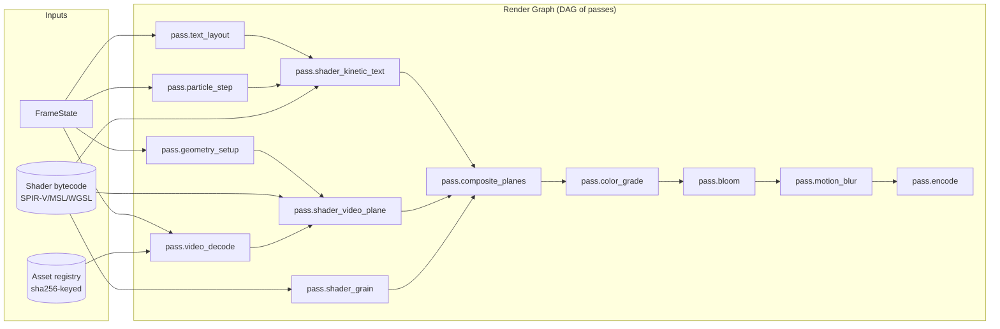
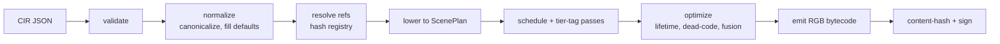
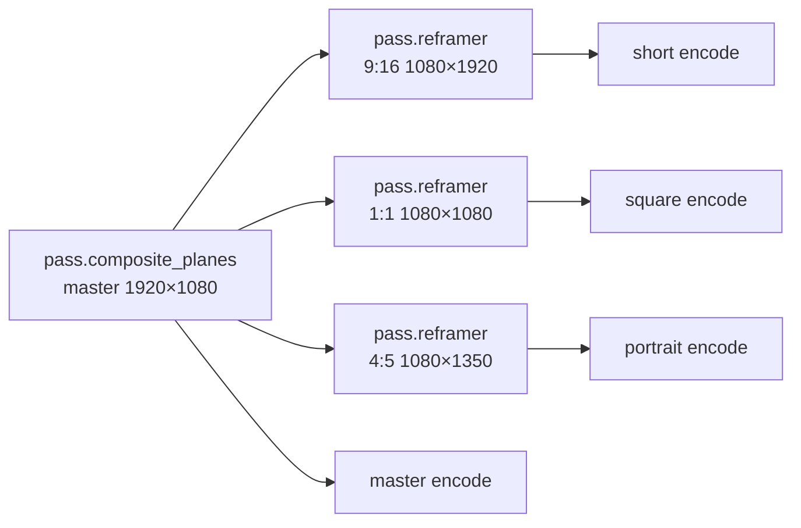
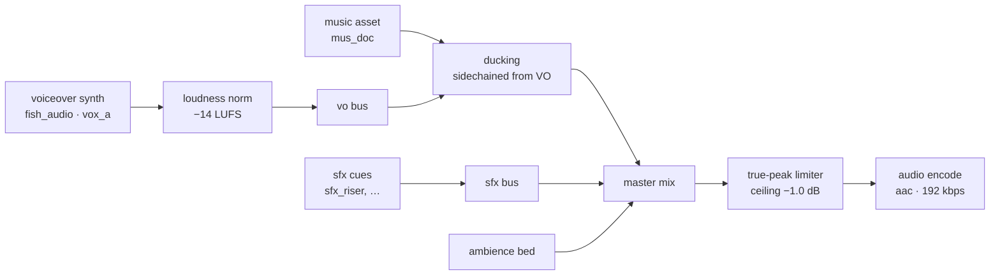

# 04 — Render Graph & GPU Execution

How the kernel turns a `FrameState` into pixels, deterministically, on
WebGPU / Vulkan / Metal — with caching, parallelism, scheduling, and
multi-target fan-out built into the graph itself.

> The kernel never executes JSON. It compiles the CIR into **render-graph
> bytecode** (RGB) — a DAG of typed passes — and the runtime is an
> interpreter for that bytecode. This is what makes determinism, sharding,
> and diff-cache feasible at scale.

---

## 4.1 Render graph: the central abstraction



Properties:

- **Static topology.** The DAG shape depends only on the FrameState's `layers` list and `render` directives. Same shape ⇒ same bytecode ⇒ same cache.
- **Typed edges.** Each edge carries a typed resource handle: `Texture2D<rgba16f>`, `Buffer<u32>`, `RenderTarget<bgra8>`, etc.
- **Ownership inferred.** The compiler analyses lifetimes and recycles render targets; transient resources are pooled per worker.
- **Per-pass cache key.** Every pass has a content-hashed cache key over (input handles' producer hashes + params + shader bytecode hash + GPU profile).

## 4.2 Pass taxonomy

| Pass | Tier | Notes |
| ---- | ---- | ----- |
| `pass.video_decode` | T1/T2 | Decode video at given t_us; hardware-accelerated where available (NVDEC, VideoToolbox, V4L2). |
| `pass.image_load` | T0/T1/T2 | Decode still asset to GPU texture (cached). |
| `pass.text_layout` | T0/T1 | Run font layout; emit glyph atlas + per-glyph quad buffers. |
| `pass.geometry_setup` | T0 | Build mesh/quad buffers from clip transforms. |
| `pass.particle_step` | T0 | Compute-shader integration, deterministic seed. |
| `pass.shader_<actor>` | T0/T1 | Per-actor shader pipeline. |
| `pass.compose_plane` | T0 | Composite a depth plane's actors into a plane RT. |
| `pass.composite_planes` | T0 | Front-to-back composite of all planes with parallax. |
| `pass.color_grade` | T0 | Apply LUT + tone curve. |
| `pass.bloom` | T0 | Multi-pass downsample/upsample bloom. |
| `pass.vignette`, `pass.grain`, `pass.chromatic_aberration` | T0 | Post-process. |
| `pass.motion_blur` | T0 | Velocity-buffer driven, samples per FrameState.camera. |
| `pass.reframer` | T0 | Saliency-aware viewport remap for non-master targets. |
| `pass.encode` | NVENC/QSV/VAAPI/SW | Encode to bitstream chunk; GOP boundary on shard cut. |

Each pass is annotated with **tier requirements**: minimum tier that can execute it, and preferred tier if multiple available.

## 4.3 Bytecode (RGB) format

```text
RenderGraphBytecode
├── header
│   ├── magic: "RGB1"
│   ├── version: u32
│   ├── target_profile: { gpu_arch, encoder_id, fp_format }
│   └── doc_hash: 32 bytes
├── string_table         (interned)
├── shader_table         (sha256 → SPIR-V/MSL/WGSL bytecode)
├── asset_table          (sha256 → metadata; bytes resolved by fetcher)
├── resource_table       (textures, buffers, render targets w/ formats + lifetimes)
├── pass_table           (typed pass nodes with input/output indices)
├── topo_order           (DAG linearization)
├── shard_breaks         (frame ranges + GOP boundaries)
└── debug_table          (optional source maps back to CIR paths)
```

RGB is **emitted by the planner, consumed by the executor**. It is reproducible byte-for-byte from `(CIR, hw_profile)` — i.e., bytecode itself has a hash and is part of the cache key for any rendered output.

## 4.4 Compilation pipeline



Compiler passes (LLVM-style, each pure function over the IR):

1. **Validate** — JSON Schema + structural rules (§3.18).
2. **Normalize** — sort keys, collapse defaults, canonicalize numbers.
3. **Resolve refs** — replace `$ref` strings with concrete IDs; assert hashes.
4. **Lower** — for each output target, emit `ScenePlan` (per-frame DAG template).
5. **Schedule** — annotate each pass with tier preference, deadline, cache key.
6. **Optimize** — common-pass elimination across actors; fuse compatible shader passes; reuse render targets across non-overlapping passes.
7. **Emit** — pack into RGB.
8. **Sign** — compute `bytecode_hash`, sign with renderer-version key.

## 4.5 Resource lifetime analysis

The compiler tracks each resource's `[first_use_pass, last_use_pass]`
window. Render targets with disjoint windows can share underlying GPU memory.

```text
RT_plane_bg     [2..7]    16 MiB      reused as RT_plane_fg [9..14]
RT_plane_sub    [4..8]    16 MiB
RT_glyph_atlas  [1..6]     4 MiB      reused as RT_velocity [7..11]
RT_master       [8..15]   16 MiB
```

A 1080p frame fits comfortably in ~80 MiB of pooled GPU memory under this
scheme — small enough for L4 / T4 GPUs to run 8+ concurrent frames.

## 4.6 Three execution tiers

| Tier | Engine | Best for | Cost (relative) |
| ---- | ------ | -------- | --------------- |
| **T0** | WebGPU compositor (Dawn/wgpu native binding) | Shader-pure scenes, post-pass chains, color, bloom, kinetic text, particles | 0.05× |
| **T1** | Headless Chromium + Remotion | Arbitrary React scenes, DOM-heavy mockups, charts | 1.0× (baseline) |
| **T2** | ffmpeg-direct filter graphs | Stock-only sequences (cuts, crossfades, Ken Burns) | 0.20× |

The capability router (§4.7) tags each pass with a tier preference at
compile time. The scheduler dispatches passes accordingly at execute time.

## 4.7 Capability router decision tree

```text
for each pass P in graph:
  if P.kind in SHADER_PURE_SET and target.has_webgpu:
    P.tier_preference = T0
  elif P.kind in REACT_REQUIRED_SET:
    P.tier_preference = T1
  elif P.kind == "pass.video_decode" or P.kind == "pass.encode":
    P.tier_preference = T2_PREFERRED, T0_OK_VIA_MEDIA_QUEUE
  elif P is a stock-only crossfade/Ken Burns chain with no overlay:
    P.tier_preference = T2
  else:
    P.tier_preference = T1
```

Per-shard tier = **the most-demanding** tier among the shard's passes (§02
sharding rules apply).

## 4.8 Shard scheduling on the DAG

Frame-range sharding (P0.2 in the implementation) lifts to the DAG:

```text
1. Compute shard boundaries on the timeline interval tree
   (always on scene-clip boundaries, GOP-aligned).
2. For each shard, slice the DAG to passes that produce frames in [start_us, end_us).
3. Audio passes are NEVER sharded — produced once at parent.
4. Each shard becomes a BullMQ job on the matching tier queue (P0.11).
5. Concat parent runs `pass.demux+remux concat` → final master.
```

Shard cache keys (§4.9) make repeat renders trivially fast.

## 4.9 Cache hierarchy on the graph

| Layer | Key | Hit ratio target |
| ----- | --- | ---------------- |
| **Bytecode cache** | `cir_hash + hw_profile + compiler_version` | 99% (warm) |
| **Asset cache** | `asset.sha256 + transform_descriptor` | 90% |
| **Pass output cache** | `pass.cache_key` (recursive over inputs) | 60–80% |
| **Frame cache** | `concat(layer.cache_key for layer in frame)` | 40–60% |
| **Shard cache** | `xor(frame.cache_key for frame in shard) + encoder_profile` | 50–70% |
| **Encoded ladder cache** | `master_hash + ladder_profile` | 80% |

Diff render = **only re-execute passes whose cache_key changed**. A
caption text edit at t=42s typically invalidates ~30 frames worth of one
shader pipeline, with everything else served from cache.

## 4.10 GPU execution model — WebGPU example

For a single frame's `pass.shader_kinetic_text`:

```wgsl
// shd_kinetic_text@v3 — sha256:…
struct Globals {
  proj_view: mat4x4<f32>,
  t_us: f32,
  active_word_index: u32,
  active_word_progress: f32,
  fill_color: vec4<f32>,
  stroke_color: vec4<f32>,
  stroke_width_px: f32,
  viewport_px: vec2<f32>,
};

@group(0) @binding(0) var<uniform> globals: Globals;
@group(0) @binding(1) var<storage, read> word_layouts: array<WordLayout>;
@group(0) @binding(2) var atlas_texture: texture_2d<f32>;
@group(0) @binding(3) var atlas_sampler: sampler;

struct VsOut { @builtin(position) clip: vec4<f32>; @location(0) uv: vec2<f32>; @location(1) word_id: u32; };

@vertex
fn vs_main(@location(0) pos: vec2<f32>, @location(1) uv: vec2<f32>, @builtin(instance_index) iid: u32) -> VsOut {
  let layout = word_layouts[iid];
  // ... transform pos by layout.bbox + globals.proj_view ...
  var out: VsOut;
  out.clip = globals.proj_view * vec4<f32>(pos, 0.0, 1.0);
  out.uv   = uv;
  out.word_id = iid;
  return out;
}

@fragment
fn fs_main(in: VsOut) -> @location(0) vec4<f32> {
  let sdf = textureSample(atlas_texture, atlas_sampler, in.uv).r;
  let word_active = f32(in.word_id == globals.active_word_index);
  let progress    = mix(0.0, globals.active_word_progress, word_active);
  let fill_alpha  = smoothstep(0.50, 0.45, sdf) * progress;
  let stroke      = smoothstep(0.55, 0.50, sdf) - smoothstep(0.50, 0.45, sdf);
  let color       = mix(globals.stroke_color.rgb, globals.fill_color.rgb, fill_alpha);
  let alpha       = max(fill_alpha, stroke);
  return vec4<f32>(color, alpha);
}
```

Bindings, layout, and the vertex/instance buffer are emitted by the
compiler from the FrameState's `shader_state` for that layer. Shader source
is referenced by sha256 in `registry.shaders` and shipped with the bytecode.

## 4.11 Determinism on GPU

GPUs are nondeterministic by default (warp scheduling, FP-fast math, parallel reduction). The kernel pins it down:

1. **No `fast_math`.** Compile shaders with strict IEEE-754.
2. **No `relaxed_atomics`.** All cross-thread sync uses sequential consistency.
3. **Stable reduction order.** When a pass reduces (e.g. luminance histogram), use a fixed-tile order, not warp-shuffle reductions.
4. **Pinned shader bytecode.** SPIR-V/MSL/WGSL is compiled once, hashed, shipped — never re-compiled per render.
5. **Pinned RNG.** `xoshiro256++` seeded per-pass; never use GPU `rand()`.
6. **GOP-aligned encode.** Encoder forced `-force_key_frames` at shard boundaries.
7. **Codec parameter pinning.** NVENC `-preset p7 -tune hq -rc constqp` produces deterministic output for our purposes (encoder version is part of `hw_profile`).
8. **Per-target hardware profile.** Cache keys include `hw_profile` so an L4 render and a T4 render don't pollute each other's cache.

When determinism cost is too high (e.g., motion-blur Monte Carlo sampling),
we use a stable QMC sequence (Halton/Sobol) rather than rejecting determinism.

## 4.12 Vulkan / Metal backends

The IR-to-bytecode lowering targets a **shader-language-agnostic** representation. We compile shaders once per backend:

| Backend | Compile path | Status |
| ------- | ------------ | ------ |
| WebGPU (Dawn / wgpu) | WGSL → SPIR-V via Tint, native via Dawn | P1 primary |
| Vulkan | SPIR-V direct (via Dawn pipeline cache) | P2 production |
| Metal | WGSL → MSL via Tint | P2 (Apple Silicon render farm) |
| D3D12 | WGSL → HLSL → DXIL via Tint+DXC | P3 (Windows only) |

The pipeline-cache layer (Vulkan PSO cache, Metal binary archives) makes
warm-start near-instant on the same device.

## 4.13 Reframer — multi-aspect via the same DAG

For each output target (master, short, square, …), the compiler emits a
**parallel sub-DAG** that branches at `pass.composite_planes` with target-specific viewport remap:



`pass.reframer` consumes:

- the master plane RT
- a saliency map produced by `pass.saliency` (CLIP+SAM2 keyframe sampling, model `mdl_saliency`)
- per-target safe zones (§3.17)
- a Kalman filter trajectory of the saliency centroid

Output: a target-resolution buffer ready for that target's encode. The
compositor runs all four encodes in parallel on different encoder
instances. Master and reframed outputs share **all upstream passes** —
that's where the cost savings come from.

## 4.14 Audio engine (graph-mirror)

Audio is a parallel graph over the same time axis:



Determinism: every node is a typed DSP block (FIR, IIR, biquad, peak
limiter) with explicit state. The audio scheduler runs at fixed sample-rate
ticks (48 kHz by default) and emits the per-frame slice into FrameState's
`audio` field for visual reactivity.

Phoneme alignment runs once per VO at plan time (`mdl_phoneme_align`), and
the phoneme/viseme stream is precomputed and indexed by t_us — not run
per-frame.

## 4.15 Particle systems

Each particle system is a deterministic compute pipeline:

```text
state[i, t+dt] = update(state[i, t], dt, params, prng_xoshiro(seed ⊕ i ⊕ t_quantum))
```

- Initial state at `t = clip.start_us` is seeded.
- Update is run in parallel across particles in a compute pass.
- Render is a separate vertex/fragment pass that reads the same buffer.
- "Random" emission times are quantized to the simulation tick.

Shippable systems at v2: dust, sparks, ribbons, snow, embers, glyph
explosion, magnetic flow lines, smoke (fluid sim deferred to P3).

## 4.16 Color science

The full pipeline:

```text
linear (working space, fp16)
  ↓ scene asset load (decoded video → undo_eotf to linear)
  ↓ per-actor shading
  ↓ composite (linear blend)
  ↓ pass.color_grade
      ← apply scene LUT (log → log_to_lin if needed)
      ← apply per-actor tonal curve (track-driven)
      ← apply brand grade LUT
  ↓ pass.bloom (linear)
  ↓ pass.vignette / grain / CA
  ↓ output transform (lin → eotf bt709 / pq / hlg)
  ↓ encode
```

Working space is fp16 linear; output transforms happen exactly once at the
end of the chain. This gives accurate light blending and deterministic
behaviour across encoders.

## 4.17 Predictive pre-rendering

When the kernel knows the deadline > 2× expected wall, it can start
**probabilistically** rendering the most-likely-to-ship variant of a clip
ahead of the agent decision. Cancellation cost is wasted GPU time, but
under time pressure that's profitable.

```text
predicted variant := argmax_v P(variant=v | channel_priors, beat_pattern)
if confidence > 0.7 and gpu_idle_share > 0.4:
  speculatively render this variant
when agent decides:
  if speculation matched: ship cached frames (zero wall delay)
  else: discard and render canonical variant
```

## 4.18 GPU execution graph — example for one frame

```text
FRAME #75  (t_us = 2_500_000)

t=0us       pass.video_decode(ast_pump_archive @ 2_500_000)        T2 / NVDEC
t=210us     pass.text_layout(words=["WHY","OIL","PRICES",...])      T0
t=410us     pass.geometry_setup(planes=[bg,subject,fg])             T0
t=520us     pass.shader_video_plane(bg)                             T0  → RT_plane_bg
t=520us     pass.shader_kinetic_text(subject)                       T0  → RT_plane_subject  (parallel)
t=520us     pass.shader_grain(fg)                                   T0  → RT_plane_fg       (parallel)
t=1100us    pass.composite_planes(bg, midbg, subject, fg)           T0  → RT_master
t=1320us    pass.color_grade(RT_master, lut_archive, tone_curve)    T0
t=1450us    pass.bloom                                              T0
t=1620us    pass.chromatic_aberration                               T0
t=1740us    pass.motion_blur                                        T0  → final color buffer
t=1900us    pass.encode(NVENC h264, frame contributes 1 frame)      NVENC

# parallel reframer subgraph for "youtube_short"
t=1320us    pass.saliency(RT_master)                                T0
t=1500us    pass.reframer(RT_master, saliency, target=9:16)         T0
t=1900us    pass.encode(NVENC h264, short)                          NVENC
```

Total wall: ~2 ms per frame for cache-cold path on an L4. At 30 fps and 4
shards, a 600-second video renders in ~600s/4 × 1ms × cache_miss_rate ≈
30s wall for a fully cold render. Warm cache: under 5s.

## 4.19 Failure modes and fallbacks

| Failure | Detection | Fallback |
| ------- | --------- | -------- |
| WebGPU unavailable on worker | feature probe at startup | route entire DAG to T1 (Chromium) |
| Shader compile fails | bytecode emit | reject CIR with `E_SHADER_COMPILE`, refuse to render |
| Asset not yet in CDN | fetcher | block plan, fetch with timeout, fail-fast or `policy.graceful_degrade` |
| OOM on plane composite | watcher | reduce internal RT precision fp16→fp16-trunc; if still OOM, halve resolution + scale + rerender flag |
| NVENC saturated | queue length on encoder | route to libx264 software encode (cost flagged) |
| Determinism check fails | golden-hash comparison in CI | block deploy until shader bytecode pinned |
| Reactive binding diverges | wall-time per signal tick exceeds budget | freeze that signal at its last value, log breach |

## 4.20 Performance envelope

For a 600s 1080p30 documentary on the v2 stack with warm caches:

| Phase | Wall time | Notes |
| ----- | --------- | ----- |
| Validate + normalize CIR | 200 ms | pure CPU |
| Resolve assets (cold) | 4 s | parallel CDN fetch |
| Lower + schedule + emit RGB | 600 ms | LLVM-style passes |
| Plan-time signal precompute (phonemes, beats, retention) | 3 s | model inference |
| Render shards (4 way) | 25 s | mostly cache-cold passes |
| Concat + master encode + ladder | 6 s | NVENC bursts |
| Reframer (3 platforms) | 4 s | shared upstream → cheap |
| QC + Critic | 8 s | local VLM |
| Upload (multipart, progressive) | 3 s | overlaps encode |
| **Total wall (cold)** | **~55 s** | |
| **Total wall (warm cache, no agent changes)** | **<10 s** | |

vs. the v1 (single-tier Chromium, no cache, naive): ~12 minutes.

> The 50× speedup is not from a faster GPU. It is from
> *not redoing the work the IR already proved is unchanged.*

## 4.21 Why this works

The render graph design enforces three properties simultaneously:

1. **Determinism** ⇒ caching is correctness-preserving.
2. **Static topology** ⇒ optimizations are tractable (LLVM-level).
3. **Typed lifetimes** ⇒ memory and GPU resources are pooled.

Every other property (sharding, reframer, repair, multi-target) is a
*consequence* of these three.
