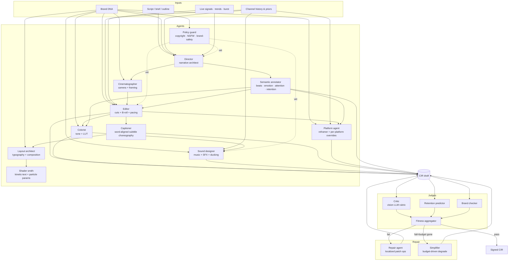

# 05 — The Cinematic Intelligence Engine (CIE)

The CIE is the upstream AI that **authors CIR**. It is the only system the
kernel will accept input from in v2. Humans interact with the CIE, never
with the IR directly.

> Think of the CIE as a **multi-agent compiler from creative intent to CIR**.
> It is to filmmaking what an LLM-driven IDE is to code.

---

## 5.1 The contract

```
input  := { script_or_intent, channel_id, brand_kit, niche, signals }
output := CIR document (validated, hashed, signed)
sla    := emits CIR within `policy.wall_deadline_s / 2` of receiving input
```

The CIE is graded on three dimensions:

1. **Validity** — emitted CIR passes `cir.validate()` 100% of the time.
2. **Cinematic quality** — Critic agent score (§5.7) ≥ 7.0 / 10 on first pass.
3. **Outcome quality** — published-video retention/CTR uplift over a baseline.

The kernel rejects CIR that fails (1). The CIE evolves to win on (2) and
(3) via supervised + RL training (§5.10).

## 5.2 Multi-agent topology



Each agent is a stateless function over `(input, ctx)` that emits a CIR
patch. The orchestrator commits patches atomically through a CIR-aware
commit layer (analogous to the v1 `applyPatch` we already shipped).

## 5.3 Agent responsibilities

| Agent | Reads | Writes |
| ----- | ----- | ------ |
| **Director** | script, brand, history, signals | `metadata`, `semantics.regions`, root timeline skeleton, `policy.fallback_policy` |
| **Cinematographer** | semantics, registry actors | per-clip transform + zoom + camera tracks; depth-plane parallax |
| **Editor** | semantics, registry assets, retention model | clip ranges, B-roll selections, transitions, pacing |
| **Colorist** | brand grade, emotion regions | LUT tracks, tone curves, vignette/CA params |
| **Sound designer** | voiceover SSML, music library | `score`, ducking, sidechain, SFX cues, beat grid |
| **Captioner** | voiceover phoneme alignment | per-word caption clips, layout boxes, emphasis tracks |
| **Layout architect** | typography library, brand tokens | font axes, kerning hints, safe-zone constraints |
| **Shader smith** | shader registry | per-clip shader uniforms, particle params, kinetic-text choreography |
| **Platform agent** | platform list, audience priors per platform | `outputs.platforms[]`, reframer strategy, per-platform clip overrides |
| **Semantic annotator** | script + emotion lexicon + retention model | `semantics.regions[]` enrichment |
| **Policy guard** | copyright DB, moderation classifier, license registry | veto signals; rewrites or blocks |

Each agent declares: `name`, `version`, `reads_paths`, `writes_paths`,
`token_budget`, `wall_budget_ms`, `model_kind` (LLM / VLM / GBM / rule /
local-small).

## 5.4 Director — turning intent into structure

```text
Director(intent, brand, niche, signals) → CIR.metadata + semantics + skeleton timeline

algorithm:
  1. Pick story pattern from { doc_arc, problem_agitate_solution, data_reveal,
     concept_reveal, news_block, list_3_2_1, before_after, myth_bust, micro_reveal }
     using:
        - niche → default pattern
        - bandit_sample(cluster="story_pattern", channelId)
        - script structural cues (questions, lists, comparisons)

  2. Parse script → utterance list with prosody guesses → beat partition.

  3. Emit semantics.regions:
        for each act:
          { kind: semantic.beat, name: act_name, range_us, emotion, retention_target }
        for each pattern interrupt point (~every 18-22s):
          { kind: semantic.pattern_interrupt, at_us, intensity, intent }
        for each attention-critical moment:
          { kind: semantic.attention_lock, range_us, target_actor: <tbd>, guidance }

  4. Emit skeleton timeline:
        timeline.sequence
          ├── compose tl_intro
          ├── sequence tl_act1 (clips: stub clips with placeholder actor refs)
          ├── sequence tl_act2
          └── compose tl_outro
```

The Director's CIR draft compiles successfully — it's renderable end-to-end
even before any other agent runs. Every other agent only *refines*.

## 5.5 Editor — the densest agent

The Editor is responsible for *most* of the bytes in the IR. Its work:

1. Walks every act's stub timeline.
2. For each beat region, chooses a story-pattern sub-template (kinetic intro / data reveal / Ken Burns montage / explainer steps).
3. Calls **Asset Discovery** (MCP tool — extends `assets/` service) for stock + AI-gen B-roll.
4. Reranks candidates (CLIP × brand-fit × phash novelty × duration fit × license).
5. Emits clip ranges per track with `transform_track`, `opacity_track`, `lut_track`, `transition_in`, `transition_out`.
6. Inserts pattern-interrupt transitions per `semantics.pattern_interrupt`.
7. Snaps cuts to nearest beat (from `score.tempo_grid_us`) within `±125 ms` window.
8. Calls **Retention Predictor** with the proposed timeline; iterates if predicted dip exceeds threshold.
9. Emits caption clips with word-level timing (provided by Captioner).

Output: a complete `timeline.tracks[]` for the master target.

## 5.6 Cinematographer — virtual camera language

Cinematographer adds `camera` motion + per-clip parallax decisions:

```jsonc
{
  "camera_track": {
    "kind": "track.bezier",
    "keys": [
      { "t_us":0,        "value":{"scale":1.00,"translate":[0,0]},"out_handle":[1500000,0.05] },
      { "t_us":3000000,  "value":{"scale":1.06,"translate":[-22,0]} },
      { "t_us":5000000,  "value":{"scale":1.10,"translate":[-40,4]} }
    ]
  }
}
```

It picks shot types from a vocabulary:

```text
{ static, slow_push, slow_pull, orbit, parallax_scroll, whip_pan,
  dolly_zoom, rack_focus, push_to_punch, hold_then_punch }
```

per-clip based on `semantics.beat.emotion.arousal` + scene type + length.

## 5.7 Critic — vision-LLM rubric scorer

Critic input: a sampled frame strip (every K frames = 1 sample/sec) +
relevant FrameState vectors + the CIR's beat semantics.

Output (rubric-strict JSON):

```jsonc
{
  "rubric": {
    "composition":            { "score":7.5, "issues":[]},
    "motion_smoothness":      { "score":8.1, "issues":[]},
    "text_legibility":        { "score":6.2, "issues":["caption stroke too thin against bright background at t=42s"]},
    "cut_rhythm":             { "score":7.8, "issues":[]},
    "color_consistency":      { "score":8.4, "issues":[]},
    "brand_fit":              { "score":7.9, "issues":[]},
    "audio_balance_perception":{ "score":7.4, "issues":[]},
    "attention_alignment":    { "score":7.0, "issues":["intended attention_lock at 240–246s undershoots — viewer eye drifts"]}
  },
  "overall": 7.5,
  "shards_flagged": [
    { "shard_id":"s7","reason":"low_legibility","severity":"medium","detail":"contrast 3.1:1 < WCAG 4.5:1" }
  ],
  "calibration_version": "iso_v3"
}
```

Models used (in priority order — picked per cost budget):

1. Local VLM (Qwen2-VL or InternVL) — runs on Tier-0 GPU pool.
2. Hosted VLM (GPT-4o vision / Claude Sonnet vision) — for borderline scores 5.0–7.0.
3. Specialist heads (text-overflow detector, contrast detector, black-flash detector) — small CNNs trained on labeled fixtures.

Calibration is isotonic-mapped per niche against a 500-sample human-rated seed.

## 5.8 Repair — localized CIR patches

Repair maps `Critic.shards_flagged` reasons to typed CIR patch ops:

```text
text_overflow      → setClipParam(clip, fontSize, cur*0.85)
black_flash        → insertTransitionIn(clip, "crossfade_3frames")
color_drift        → resetLutTrackToBrandDefault(clip)
asset_mismatch     → regenerateAsset(clip, stricter_filter=true)
audio_drift        → enableDucking(score, ratio=4.0)
low_legibility     → setClipParam(clip, fontWeight=700, fillColor=brand.text)
stale_motion       → setClipParam(clip, animationsIn=["fadeIn"])
attention_undershoot → addTransition(zoom_punch) at attention_lock.range_us[0]
                     + boostShader(kineticText, intensity*1.2)
```

Bounded retries: max 2 repair loops per CIR before escalation to Simplifier.

## 5.9 Simplifier — budget-driven degrade

When the cost ceiling is breached or repair loops exhausted, Simplifier
*reduces* the CIR to a cheaper variant:

- T0 → T1 fallback for risky shaders.
- Drop bloom + chromatic aberration.
- Reduce particle-count by 50%.
- Replace AI-gen B-roll with stock equivalent.
- Drop non-master output targets except YouTube-long.

It always produces a renderable CIR; "fail closed" is the last resort.

## 5.10 Training pipeline for the CIE

Three stacked loops:

### Loop 1 — supervised on accepted CIRs

- Every published video's final CIR is logged with its outcome metrics.
- Dataset = `(input_brief, brand, niche, history) → CIR`.
- Train per-agent specialist models (small — 7–14B) via supervised fine-tuning to mimic accepted outputs.

### Loop 2 — preference learning (DPO)

- For 5% of jobs, generate two CIR variants (different bandit-arm pulls).
- Render both as 6-second hooks, present to internal reviewer.
- Train preference model on pairwise judgments → DPO-tune the editor LLM.

### Loop 3 — outcome reward (online)

- Every published video collects YouTube retention + CTR after 24h/7d.
- Reward = retention_lift × CTR_lift over channel baseline.
- Update bandit posteriors over `{story_pattern, pacing, transition_family, caption_style, hook_type, music_mood}`.
- Bandit posteriors feed back into Director + Editor sampling.

## 5.11 MCP tools the CIE invokes

The CIE talks to the kernel + sister services via the MCP server we already
shipped (P0.9), evolved:

| Tool | Direction | Purpose |
| ---- | --------- | ------- |
| `propose_scene` | CIE → kernel | request kernel to compile + dry-run a partial CIR |
| `render_preview` | CIE → kernel | render a 3-second slice for critic |
| `query_registry` | CIE → kernel | list shaders / actors / luts / sfx by tag |
| `get_qc_report` | CIE → kernel | post-render dual-gate report |
| `query_assets` | CIE → assets svc | content-aware stock + AI-gen lookup |
| `phoneme_align` | CIE → models svc | wav2vec2 alignment |
| `beat_detect` | CIE → models svc | librosa-style beat grid |
| `saliency` | CIE → models svc | CLIP+SAM2 saliency map |
| `predict_retention` | CIE → models svc | per-window retention curve |
| `predict_render_cost` | CIE → kernel | cost estimate for current CIR |
| `pull_bandit_arm` | CIE → analytics svc | Thompson sample arm |
| `commit_outcome` | analytics → kernel | record outcome for training |

All tools have typed schemas. The CIE never makes raw HTTP calls.

## 5.12 Authoring example — 60-second short, end-to-end

```text
1. Input: "60-second YouTube Short: 3 hidden lessons from the 1973 oil crisis"
2. Director:
   - pattern = bandit_sample("story_pattern_short") → "list_3_2_1"
   - duration_us = 60_000_000
   - emit semantics: hook 0–4s, lesson1 4–22s, lesson2 22–40s, lesson3 40–58s, cta 58–60s
   - emit skeleton: timeline.sequence with 5 stub sub-sequences
3. Cinematographer:
   - hook  → shot=push_to_punch, parallax intense
   - lessons → shot=parallax_scroll
   - cta   → shot=hold_then_punch
4. Editor:
   - asset query "1973 oil crisis archive" → 12 candidates
   - rerank: pick (sha256:8b…), (sha256:1f…), (sha256:c2…)
   - cuts at [0, 4_000_000], [4_000_000, 22_000_000], …
   - transitions: zoom_punch at boundaries
   - call retention predictor → predicted dip at 30s → insert pattern interrupt at 28s
5. Captioner:
   - phoneme_align(voiceover) → per-word timings
   - caption style = "word_karaoke" (bandit pull)
6. Colorist:
   - apply lut_archive at 0.85 strength on archival clips
   - per-segment tone curve from emotion arc
7. Sound:
   - music = mus_doc_short, level=-8 dB, ducking=ratio 4
   - SFX riser at 0.4s, impact at 4.0s, woosh transitions
8. Layout:
   - Inter Black 96px, stroke 6px, color brand.primary
9. Platform:
   - outputs.master = 1080×1920 master (this IS the short, no master long)
10. Semantic annotator:
   - boost importance on first 4s (hook), 28s (interrupt), 58s (cta)
11. Guard:
   - license check passes; brand-safety passes
12. Critic on 6 sampled frames:
   - overall=8.1, no high-severity flags → ship
13. Sign + emit CIR (~28KB JSON for this short)
14. Kernel compiles + renders in ~6s wall on warm cache
```

## 5.13 Cost model for the CIE

| Item | Tokens / job (typical) | Cost @ Sonnet/Opus rate |
| ---- | ---------------------- | ----------------------- |
| Director plan | 8k in, 3k out | $0.08 |
| Editor (chunked over acts) | 25k in, 10k out | $0.30 |
| Cinematographer | 4k in, 2k out | $0.04 |
| Colorist | 3k in, 1k out | $0.02 |
| Sound | 4k in, 1k out | $0.03 |
| Captioner | 6k in, 3k out | $0.05 |
| Critic (vision) | 2k in + 30 images, 1k out | $0.10 |
| **Total CIE per long-form video** | — | **~$0.62** |

With per-channel specialists (small fine-tuned models) the cost drops to
**~$0.12** per video by year 2 — and **$0** at the marginal limit when
diff-cache hits.

## 5.14 Authoring philosophy

1. **The CIE never edits CIR text.** It emits patches through the typed
   commit API. (This eliminates a whole class of "LLM produced invalid
   JSON" failures.)
2. **Critic is a co-equal, not a sanity check.** Two of three published
   videos in v2 will go through ≥ 1 repair loop.
3. **Every agent is replaceable.** A specialist Cinematographer model can
   be swapped without changing the IR.
4. **Bandits everywhere.** Every "creative choice" is parameterized as an
   arm; outcomes update posteriors.
5. **Determinism is sacred.** A CIE re-run with the same seed and same
   bandit posteriors must produce the same CIR.

The CIE is, in effect, **a programming-language compiler for cinematic
intent**, with the IR as the binary it produces. The kernel (file 04) is
the CPU that runs that binary.
