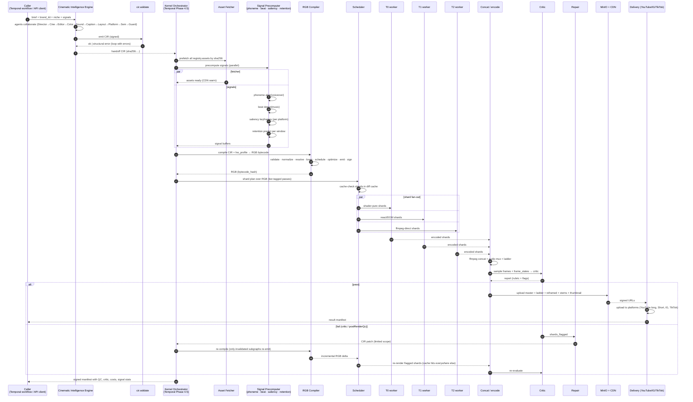

# 06 — Execution Lifecycle & Moonshots

The end-to-end story: from "the user asks for a video" to "frames hit
YouTube". Then the moonshots — what becomes possible once the kernel +
CIE + IR are stable.

---

## 6.1 The full lifecycle



## 6.2 Phase-by-phase

### Phase A — Authoring (CIE)

- Triggered by Temporal workflow `VideoProductionWorkflow` Phase 3.5 (post-direction).
- Wall budget target: 30–60 s for a 10-min video.
- Outputs: signed CIR (typically 80–400 KB JSON).
- Failure modes: schema validation loop; agent budget exhaustion → Simplifier.

### Phase B — Plan-time precompute (kernel orchestrator)

- Asset fetcher walks `registry.assets` and warms CDN.
- Signal precomputer runs phoneme alignment + beat detection + saliency
  keyframes + retention model.
- These outputs are cached *per asset/signal sha256* — not per CIR — so
  reused across renders.
- Wall budget: 2–10 s; entirely parallel-IO-bound.

### Phase C — Compile

- The `cir → RGB bytecode` lowering. LLVM-style passes (validate,
  normalize, resolve, lower, schedule, optimize, emit, sign).
- Wall budget: 200–800 ms.
- Output: `RenderGraphBytecode` + `bytecode_hash`. Cached keyed by
  `(cir.hash, hw_profile, compiler_version)`.

### Phase D — Schedule + shard

- The scheduler walks RGB, identifies cuttable boundaries (scene edges +
  GOP), emits N shards.
- For each shard: cache lookup.
- Cache-hit shards are downloaded directly from MinIO; cache-miss shards
  are dispatched to tier queues.
- Concat parent waits for all shards.

### Phase E — Render

- T0/T1/T2 workers execute their shards.
- Each worker processes passes per FrameState (§02), with tier-specific
  optimizations:
  - T0: WebGPU pipeline-cached, NVENC zero-copy.
  - T1: Chromium with bundle warm-volume (P0.5).
  - T2: ffmpeg `filter_complex` direct.
- Shard outputs: GOP-aligned MP4 chunks + per-shard manifest.

### Phase F — Concat + reframer + ladder

- Parent runs `ffmpeg concat -f concat`.
- Audio mux from precomputed `score` mix.
- Reframer sub-DAG (§4.13) runs in parallel for each platform target.
- Ladder fan-out for ABR.

### Phase G — Dual-gate QC

- `postRenderQc` (numeric) — duration, luminance, black fraction, audio
  presence, true-peak, LUFS.
- Critic agent (rubric VLM) — sampled frame strip + frame states.
- BOTH must pass. If critic OR numeric fails → repair loop (max 2).

### Phase H — Upload + delivery

- Multipart MinIO upload (started during encode for progressive).
- CDN warm-up.
- Manifest emitted with: `cir.hash`, `bytecode.hash`, `master.sha256`,
  `ladder[].sha256`, `reframed[].sha256`, `stems[].sha256`,
  `thumbnail.sha256`, `qc.report`, `critic.report`, `cost_breakdown`,
  `signal_stats`.
- Delivery service uploads per platform.

### Phase I — Outcome ingest (24h–7d later)

- Analytics service polls YouTube / IG / TikTok APIs.
- Retention curves + CTR + likes/comments/shares written to
  `video_outcomes`.
- Bandits update over the arms recorded in `cir.diagnostics.decisions`.
- Critic calibration updates (isotonic) with the new ground truth.

## 6.3 The compile-cache-render math

Three cache layers compound:

```
compile_cache_hit_rate × shard_cache_hit_rate × bytecode_cache_hit_rate
```

For a channel that publishes daily with stable brand kit:

| Layer | Hit rate (steady state) |
| ----- | ---------------------- |
| compile cache | 60% (upstream changes ≈ 40% of the time) |
| shard cache | 70% |
| bytecode cache | 99% (only invalidates on engine deploy) |

Effective renderer-work ratio ≈ `1 − 0.60·0.99 − 0.70·(1−0.60·0.99)·0.99 ≈ 11%` of cold-start work. Most jobs become "compile + 11% of shards + concat".

## 6.4 Determinism contract (formal)

Define:
- `H_doc` = `cir.hash`
- `H_bc`  = `compile(cir, hw_profile, compiler_version).hash`
- `H_out` = `execute(bc, seed_root).hash`

Then:

> ∀ two systems S₁, S₂ with identical `(cir, hw_profile, compiler_version,
> shader_bytecode_pinned, encoder_profile_pinned)`, S₁ produces a
> bitstream byte-equal to S₂.

The kernel's CI runs **golden-master perceptual + binary tests** on every
PR to enforce this. Violations are P0 incidents.

## 6.5 Failure surface and recovery taxonomy

| Failure | Detection | Auto-recovery | Manual escalation |
| ------- | --------- | ------------- | ----------------- |
| CIE produces invalid CIR | `cir.validate()` | Repair by prompt-replay with errors fed back | Human review queue |
| Asset 404 / license expired | fetcher | Editor agent re-queries assets | Block job |
| Signal precompute timeout | watchdog | Use last-cached signal | Block if no cache |
| Compiler crash | exception | Retry once with `compiler.fallback_passes=true` | P0 alert |
| Shard render fail (CUDA OOM) | worker | Drop to lower precision / smaller RT | T1 fallback |
| NVENC ring full | encoder queue | Route shard to libx264 | Cost flag |
| Concat fail (GOP mismatch) | ffmpeg concat | Re-encode shards with strict GOP | P0 alert |
| Critic fails | rubric | Repair loop (max 2) → Simplifier | Human review |
| postRenderQc fails | numeric | Same as critic-fail | Block publish |
| Upload partial | MinIO multipart | Resume / retry | Block publish |

Every failure path is **logged as a structured event** keyed by
`cir.hash + phase`. The replay tool can reconstruct the entire job from
logs + bytecode cache.

## 6.6 Observability surface

| Signal | Source | Use |
| ------ | ------ | --- |
| `cir_validate_total{result}` | validator | quality of CIE |
| `cir_compile_duration_seconds{phase}` | compiler | compile-time perf |
| `bytecode_cache_hit_ratio` | cache | engine version stability |
| `shard_render_duration_seconds{tier,kind}` | workers | per-tier perf |
| `shard_cache_hit_ratio{tier}` | cache | content reuse |
| `frame_eval_duration_us` | runtime | per-frame budget |
| `critic_pass_rate{niche,channel}` | critic | quality gate |
| `repair_loop_count{reason}` | orchestrator | repair effectiveness |
| `cost_usd_per_video{kind}` | aggregator | unit economics |
| `bandit_arm_uplift{cluster,arm}` | analytics | learning signal |
| `signal_precompute_duration_seconds{kind}` | sig svc | signal cost |
| `determinism_violations_total` | CI | invariant guard |

Grafana dashboards: **CIE Quality**, **Kernel Performance**, **Cost**,
**Determinism**, **Outcomes**.

## 6.7 Migration from v1 (the P0 we shipped) to v2

The v1 work (SceneGraph IR + sharding + tiered queues + critic + repair +
director + editor + MCP + Python SDK + DB migrations) is **not thrown
away**. It becomes the v2 kernel's *T1 path*:

| v1 component | Becomes (v2) |
| ------------ | ------------ |
| `SceneGraph` IR | `cinematic.core` dialect of CIR — extended with stage/score/registry/semantics/reactive |
| `lower(directionV3)` | `lower_legacy(directionV3) → CIR(cinematic.core only)` shim — keeps backwards compat |
| `planShards` | sharder over RGB instead of SceneGraph |
| `flow.ts` FlowProducer | unchanged; queues become RGB shard queues |
| Critic agent | unchanged interface; consumes FrameState samples + frame strip |
| Repair agent | unchanged interface; emits CIR patches |
| Director / Editor agents | one of N agents in the CIE multi-agent topology |
| MCP server | unchanged — gains new tools (`compile_cir`, `validate_cir`, `query_signals`) |
| Python SDK | unchanged base — gains `CirClient` |
| Tier worker entry | unchanged — gains RGB bytecode interpreter mode |
| DB migrations | extended with `cir_documents`, `bytecode_cache`, `signal_buffers` |

Migration plan:

1. **v1.1** — ship `lower_legacy()` shim. Existing direction-v3 inputs continue to work, just go through CIR internally.
2. **v1.2** — add CIR-direct API endpoint (`POST /api/cir`). New CIE callers target this.
3. **v1.3** — RGB compiler ships behind feature flag (`CIR_BYTECODE_ENABLED`); compile-time validation runs in shadow mode.
4. **v2.0** — RGB bytecode is the only execution path. `direction-v3` accepted only via the legacy shim.
5. **v2.1** — deprecate `direction-v3`. Sunset over 6 months with notices.

## 6.8 Success metrics by quarter

| Q | Goal | Critical metric |
| - | ---- | --------------- |
| Q1 | CIR + RGB compiler ship behind flag | compiler validate rate ≥ 99% on shadow |
| Q2 | RGB rendering enabled for 1 channel in production | render p95 ≤ v1 p95 |
| Q3 | Multi-target reframer + tier-0 GA | $/video ≤ $0.18 |
| Q4 | Cinematic Intelligence Engine GA | critic pass-on-first-attempt ≥ 90% |
| Q5 | RLHF DPO loop in production | retention lift +12% over baseline |
| Q6 | Specialist small-model agents | CIE cost ≤ $0.15/video |

---

# 6.9 Moonshots

What becomes feasible once the kernel + CIR + CIE are real. None of
these are required for the system to be valuable — they are *consequences*
of having a deterministic, typed, GPU-native cinematic OS.

## 6.9.1 The Cinematic Bytecode (RGB) as a portable artifact

If `RGB` is hardware-portable (compiled per-target shader bytecode + a
device-agnostic graph), then the **same artifact** can render on:

- Cloud render mesh (production)
- Edge render at viewer device (interactive frames)
- Mobile device (preview + share)

This implies a **cinematic equivalent of WASM**: ship the RGB to any
device with a compatible runtime, render locally, with the same fidelity.

## 6.9.2 Real-time agent-in-the-loop authoring

Because `evaluate_frame(t_us)` is pure, an editor UI can:

- Stream live preview from a Tier-0 compositor over WebRTC.
- Apply a CIR patch — kernel recomputes only invalidated layers.
- Show diff visualization (which frames changed).
- Round-trip latency < 200ms for small patches.

This is **collaborative film authoring at IDE speeds**.

## 6.9.3 Inverse cinematography

Given a reference video (e.g. a viral creator's intro), train a model to:

```
inverse_render(reference_video) → CIR
```

The kernel re-renders the CIR and we compare. Gradient signal trains the
model. The result: **automatic style transfer at the IR level** — not
pixel-space style transfer (which loses semantics), but cinematographic
style transfer (cuts, transitions, framing, color, pacing).

## 6.9.4 Foundation-model video as a node, not a replacement

Sora / Veo / Kling become **clip generators** behind the actor abstraction:

```jsonc
{
  "kind": "actor.generative_video",
  "model_ref": "mdl_sora_v3",
  "prompt": { "structured": {/*…*/}, "style_lora_ref": "lora_brand_v2" },
  "seed": 7,
  "duration_us": 4000000,
  "provenance": { "kind": "ai_generated", "c2pa_manifest_ref": "…" }
}
```

The kernel calls the model at plan time, caches the resulting clip by its
prompt hash, and treats it as a regular asset thereafter. **Determinism +
caching make using generative models economically viable.** Two videos
that prompt for "1970s oil rig at dusk" pay the model cost once.

## 6.9.5 Personalized cinematic delivery

Same CIR, per-viewer reframing + emphasis:

```jsonc
{
  "kind": "output.platform",
  "id": "viewer_personalized",
  "viewport_px": [1920, 1080],
  "reframe_strategy": { "kind": "saliency_per_viewer", "viewer_signals": ["region","device_class","known_history"] },
  "caption_personalization": { "language": "$.viewer.language", "level": "$.viewer.literacy_level" }
}
```

Kernel fan-out is parameterized by viewer cohort. Cost is flat per
cohort, not per viewer (cohorts are typically O(100) per channel).

## 6.9.6 Procedural cinematic universes

A **cinematic universe** = a versioned bundle `{registry, stage,
shaders, brand, signature_patterns, voice_clones}`.

```jsonc
{ "$ref": "cu://channels/finance-history@v3" }
```

Any CIR can declare which universe it inhabits. Universes are content-
addressed, sharable, and forkable. A single creator can run dozens of
"shows" each in their own universe, and a community can fork+remix
cinematic universes the way GitHub repos work.

## 6.9.7 Frame-perfect interactive video

Reactive bindings + edge runtime means:

- Branch at `timeline.branch` keyed on real-time viewer input
  (click, gaze, vote).
- Re-evaluate downstream frames < 16 ms.
- Used for: course modules, choose-your-own narratives, ad targeting,
  e-commerce placements.

The kernel is **already a soft-realtime engine** for cache-hot frames.
Interactive video is one feature flag away.

## 6.9.8 Cinematic agent benchmark

Open-source `(brief, brand, niche) → CIR` benchmark with held-out human
judgments. Becomes the **SWE-bench of cinematic AI**. Hosted leaderboard
+ evaluation = our distribution wedge.

## 6.9.9 Specialized cinematic chips

Once RGB bytecode stabilizes, ASIC vendors can target it directly. A
"cinematic accelerator" that runs the kernel's pass set in fixed-function
silicon would dominate per-frame latency. NVIDIA's existing DGX line is
already 80% of the way there.

## 6.9.10 Provenance-by-construction

Every frame the kernel emits is traceable to:

- the CIR sub-tree responsible for it (via cache_keys)
- the upstream agent decisions (via diagnostics)
- the model versions used (via registry)

Embed a **C2PA manifest** in the encoded stream. Every video the system
publishes is cryptographically auditable: which model wrote which decision,
which asset came from where, which shader version rendered which frame.

This is what enterprise media + regulatory environments will require by
2027. We have it for free.

## 6.9.11 Cinematic Differentiable Rendering (research)

If every pass is implemented with differentiable shader kernels (a la
Mitsuba 3 / nvdiffrast), then **gradients flow from the encoded video back
to CIR parameters**. We can ask:

> Find a CIR patch that maximizes predicted retention while staying within
> brand constraints.

Run gradient descent in CIR-parameter space. This is the long-term form
of the editor agent.

## 6.9.12 Cinematic VM spec (open standard)

Publish the RGB bytecode spec as an open standard. Any compliant runtime
(ours, a competitor's, an OSS one) plays the same artifact. The CIR + RGB
become to cinematic AI what HTML + DOM became to documents.

We host the most performant runtime. Competitors interoperate.

---

## 6.10 The closing thesis

Every layer of this system follows from **one decision**: treat video
production as a *compilation problem*, not an *editing problem*.

- The IR (file 01) is the source language.
- The frame contract (file 02) is the value semantics.
- The timeline (file 03) is the program structure.
- The render graph (file 04) is the machine code.
- The CIE (file 05) is the compiler frontend (LLM-driven).
- The kernel is the compiler backend + runtime.
- The lifecycle (file 06) is the build system.
- The moonshots are the consequences.

That's the entire cinematic OS in one paragraph. Everything else is
implementation discipline.
