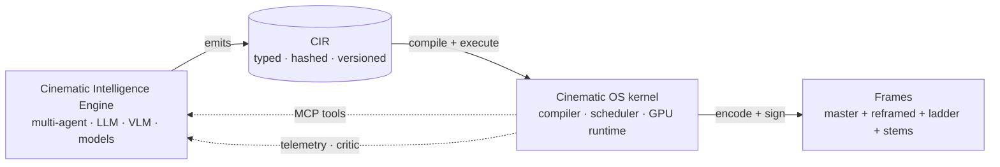

# Cinematic OS — Doc Index

A radical v2 redesign of the rendering engine inside `yt-automation-n8n`,
positioned as a **Cinematic Operating System**: a deterministic, GPU-native,
agent-authored execution environment that compiles cinematic intent into
photons.

> One-sentence thesis: **stop authoring videos. start compiling them.**

This set supersedes (but does not delete) the v1 `docs/future/remotion-vision/` files,
which remain as the v1 plan + the basis for the P0 implementation already
shipped under `services/remotion/`.

---

## Reading order

| # | File | Audience | Length |
| - | ---- | -------- | ------ |
| 0 | `manifesto.md` | All | Short |
| 1 | `cinematic-ir.md` | Eng, ML, integrators | Long |
| 2 | `frame-contract.md` | Eng, ML | Long |
| 3 | `timeline-and-scene-graph.md` | Eng | Long |
| 4 | `render-graph-and-gpu.md` | Eng, infra, GPU | Long |
| 5 | `cinematic-intelligence-engine.md` | ML, agents, research | Long |
| 6 | `execution-lifecycle-and-moonshots.md` | All | Long |

10 minutes: read `manifesto.md` and §6.10 of `execution-lifecycle-and-moonshots.md`.
2 hours: read all in order.

---

## The four boundaries

The contracts:

- **CIE → CIR**: only the IR JSON. Anything else is internal to the CIE.
- **CIR → COS**: only the IR JSON. Anything else is internal to the kernel.
- **COS → OUT**: bitstream + signed manifest + sidecar telemetry.
- **COS ↔ CIE**: typed MCP tools (the kernel's tool surface).

These boundaries let either side be re-implemented independently. The
kernel could be rewritten in Rust + wgpu without touching the CIE; the CIE
could be replaced by a fine-tuned specialist model ensemble without
touching the kernel.

---

## Relationship to v1 + shipped P0

The v1 work that already shipped under `services/remotion/` becomes the
**T1 path** of the v2 kernel. Specifically:

| Shipped in P0 | Role in v2 |
| -------------- | ---------- |
| `src/scene-graph/` | `cinematic.core` dialect + `lower_legacy()` shim |
| `src/api/flow.ts` + `queues.ts` | RGB shard fan-out (unchanged interfaces) |
| `src/utils/diffCache.ts` | layer-level cache (lifted to RGB pass-output cache) |
| `src/utils/encoder.ts` | encoder routing (unchanged) |
| `src/utils/bundleCache.ts` | T1 bundle cache (unchanged) |
| `src/agents/{director,editor,critic,repair}.ts` | reference agents inside the CIE |
| `src/mcp/server.ts` + `tools.ts` | kernel's MCP surface (extended with CIR tools) |
| `sdk/python/yt_engine/` | Python clients (extended with `CirClient`) |
| `scripts/init-db.sql` migrations | base schema (extended with `cir_documents`, `bytecode_cache`, `signal_buffers`) |

Migration plan: §6.7 of `execution-lifecycle-and-moonshots.md`.

---

## What's in each file (one-liner each)

- **`manifesto.md`** — paradigm shift. Why "compiling" beats "editing".
- **`cinematic-ir.md`** — the IR itself: dialects, JSON Schema, hashing,
  worked example. The single contract that crosses every boundary.
- **`frame-contract.md`** — the per-frame `FrameState` value: every
  field, how it's resolved from the IR, why determinism holds.
- **`timeline-and-scene-graph.md`** — timeline grammar (sequence,
  parallel, branch, switch, loop, warp, reactive, template) + spatial
  scene graph + validation rules.
- **`render-graph-and-gpu.md`** — DAG of typed render passes; RGB
  bytecode; LLVM-style compile pipeline; T0/T1/T2 execution; GPU
  determinism; reframer + ladder fan-out.
- **`cinematic-intelligence-engine.md`** — multi-agent topology
  (Director, Cinematographer, Editor, Colorist, Sound, Captioner, Layout,
  Shader smith, Platform, Semantic annotator, Guard, Critic, Repair,
  Simplifier) + training loops + cost model.
- **`execution-lifecycle-and-moonshots.md`** — full lifecycle from
  brief to upload + 12 research moonshots that fall out of the design.

---

## Glossary (cross-file)

| Term | File where defined | Meaning |
| ---- | ------------------ | ------- |
| **CIR** | 01 | Cinematic IR — the typed JSON document |
| **RGB** | 04 | Render-Graph Bytecode — kernel-internal binary |
| **CIE** | 05 | Cinematic Intelligence Engine — upstream multi-agent author |
| **FrameState** | 02 | Typed per-frame value passed to GPU |
| **Track** | 03 | Continuous-time function over a parameter |
| **Pass** | 04 | A node in the render-graph DAG |
| **Tier** | 04 | T0 (WebGPU) / T1 (Chromium) / T2 (ffmpeg-direct) |
| **Cinematic universe** | 06.9.6 | Versioned `{registry, stage, brand, voice}` bundle |
| **Provenance** | 06.9.10 | C2PA-style chain from frame → CIR → agents → models |

---

## What this doc set is NOT

- Not a tutorial for using Remotion.
- Not a sales document.
- Not green-fielded — every claim is anchored to the v1 code we shipped
  or to a concrete extension surface in this repo.
- Not a list of features. It is a *coherent architecture* with four
  contracts and one IR. Features fall out of the design.

---

## How to evaluate this design

If we did our job right:

1. The CIR is unambiguous enough that two independent kernel
   implementations would render the same bytes.
2. Every "feature" the user requested in the brief
   (frame-perfect timing, microsecond animation, AI cinematography,
   multi-aspect adaptation, semantic storytelling, GPU rendering)
   is *expressible* as a typed construct in the IR or render graph,
   not as ad-hoc plumbing.
3. The migration path from the v1 P0 we already shipped is concrete and
   non-disruptive (§6.7).
4. The moonshots (§6.9) are *consequences* of the design, not bolt-ons.

If any of those four properties fail to hold, the design needs to be
revised before any code is written against it.
