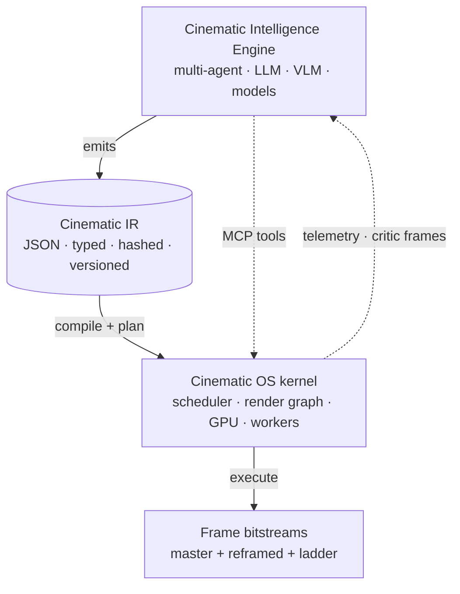

# 00 — Manifesto: from "video renderer" to **Cinematic Operating System**

> A traditional video editor is a *tool* an editor uses to assemble clips.
> A cinematic operating system is an *execution environment* that compiles
> AI-authored cinematic intent into deterministic photons. Editors do not
> use it. Filmmaking models *target* it.

This is the v2 redesign of the `services/remotion` engine inside
`yt-automation-n8n`. It supersedes the v1 vision (`docs/remotion-vision/00..08`)
and the P0 implementation we just shipped becomes its **kernel core**.

---

## 0.1 Paradigm shift

| Dimension | v1 (current) | v2 (Cinematic OS) |
| --------- | ------------ | ----------------- |
| **Mental model** | Renderer behind an API | Execution kernel that compiles cinematic IR |
| **Input** | direction-v3 JSON (script-like) | **Cinematic IR (CIR)** — frame-perfect, microsecond-keyed, GPU-aware |
| **Authoring** | Humans writing JSON, light AI assist | LLMs / specialized models *required* to emit CIR; humans only patch |
| **Determinism** | "Same input → same bytes" | **Hermetic, bit-reproducible across hardware** with seeded RNG, pinned shader bytecode, content-hashed assets |
| **Granularity** | Scene = clip with `duration_ms` | Every frame is a **typed state** (camera, lighting, layers, particles, audio, attention map) |
| **Timeline model** | Flat list of segments | **Nested / parallel / branching / conditional / reactive** timeline tree |
| **Rendering** | One Chromium per render | Multi-tier scheduler over a render-graph DAG: WebGPU compute → Chromium → ffmpeg-direct |
| **Audio** | Voiceover + BGM + SFX cues | Phoneme-aligned VO, beat-locked cuts, multi-bus mixer, per-frame envelope |
| **Reframer** | Separate compositions | One CIR → all aspects via saliency-aware viewport graph |
| **AI** | Optional critic + repair | **Required Cinematic Intelligence Engine (CIE)** upstream; engine is one subsystem of the AI |
| **Cost model** | $ per render-min | $ per frame × tier; cache hit = 0 |
| **Ecosystem** | Plugins to a renderer | MCP-native operating system: agents, registries, shaders, rubrics, beats, all addressable as tools |

## 0.2 What "cinematic-grade precision" means here

Concrete commitments the system makes — these are testable, not aspirational:

1. **Microsecond keying.** Every event in the CIR has a `t_us: u64` — microseconds from program origin. fps is a *display* concept, not an *authoring* concept. (30fps content has frame boundaries derived from the same 1µs grid as 240fps.)
2. **Frame-perfect determinism.** `compile(CIR, hw_profile) → bytecode`; `execute(bytecode, seed) → bitstream`. Same bytecode + same seed + same hw_profile → identical bytes byte-for-byte.
3. **No hidden state.** Every frame state is fully reconstructible from CIR + seed + frame index. There is no "previous-frame value" lurking in a React closure.
4. **Typed semantics.** "Emotional beat", "attention focus", "retention hook" are first-class typed annotations on frames, not external metadata.
5. **Hermetic assets.** Every asset is referenced by `sha256` + transform descriptor. URL fetches happen at compile time, not at frame time.
6. **Render graph DAG.** Each frame is a DAG of render passes (geometry, particles, shaders, mask, composite, color, encode). The scheduler decides parallelism + tier per node.
7. **Author-machine, not human.** The CIR is JSON — but it is "JSON the way LLVM IR is text". Humans don't author it from scratch; they patch it through tools. The grammar deliberately makes hand-authoring tedious.
8. **Reactive runtime.** Timelines can read live values (audio level, viewer scroll position in interactive embeds, retention-prediction score) and mutate downstream frames before they render.

## 0.3 What this is NOT

- Not Premiere or AE replacement — those are for humans assembling shots.
- Not Sora — Sora produces pixels from prompts; we *compile* AI-authored cinematic intent into frames using a hybrid of stock footage, generative clips, shaders, and React scenes.
- Not a game engine — but it borrows Unreal Sequencer's structure, Pixar's render-pass thinking, and Resolve's color science.
- Not "another low-code video tool" — the IR is intentionally hostile to hand-authoring.

## 0.4 Reference comparisons (and what we steal from each)

| System | What we steal | What we leave |
| ------ | ------------- | ------------- |
| **Unreal Sequencer** | Hierarchical track tree, sub-sequencers, blendable parameter tracks | Realtime-game scope; we are offline-first |
| **Pixar / RenderMan** | Render-pass DAG, deep compositing, deterministic shading | Geometric rendering of full 3D scenes |
| **DaVinci Fusion** | Node graph compositing, color science | Manual UI |
| **After Effects** | Layer model, mask hierarchy, expressions | Single-doc, single-user paradigm |
| **LLVM** | IR + passes + targets | Compile-to-machine-code; we compile to render-graph bytecode |
| **Vulkan / WebGPU** | Explicit pipelines, render-pass primitives | Realtime-game scope |
| **TensorFlow XLA / MLIR** | Multi-level IR, dialect-style typing | Math-only; we extend to cinematic dialects |
| **Pro Tools / Ableton Live** | Multi-bus mixer, sidechain, per-frame automation | Human DAW UX |
| **Resolve Color Page** | Per-shot grading nodes, log/linear/timeline pipeline | Manual workflow |
| **Sora / Runway / Pika** | Generative clips as **assets** | Replacing the editor |

## 0.5 Stack-level positioning

The Cinematic OS sits between three existing populations of code:

Three boundaries are sacred:

- **CIE → CIR**: only contract is the IR schema. CIE can be rewritten without touching the kernel.
- **CIR → COS**: only contract is the IR schema. The kernel can be rewritten in Rust+wgpu without touching CIE.
- **COS → OUT**: bitstream + sidecar manifests (QC, critic, telemetry).

## 0.6 What the rest of this set covers

| File | Topic |
| ---- | ----- |
| `01-CINEMATIC-IR.md` | The IR itself — types, dialects, JSON schema, examples |
| `02-FRAME-CONTRACT.md` | What every frame state must specify; how to derive it |
| `03-TIMELINE-AND-SCENE-GRAPH.md` | Nested / parallel / branching / reactive timelines + scene graph |
| `04-RENDER-GRAPH-AND-GPU.md` | DAG of render passes; WebGPU/Vulkan execution; scheduler |
| `05-CINEMATIC-INTELLIGENCE-ENGINE.md` | Upstream agents, model topology, contracts |
| `06-EXECUTION-LIFECYCLE-AND-MOONSHOTS.md` | End-to-end lifecycle; moonshot research bets |

Read in order. Each builds on the previous.

## 0.7 The one-sentence thesis

> **Stop authoring videos. Start compiling them.**
